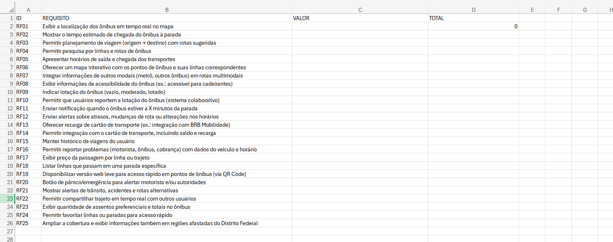

# $100 Dollars

## Introdução

A técnica **$100 Dollars** (ou "Teste dos $100") é um método de priorização colaborativa e rápida que ajuda times a descobrirem o que **realmente tem mais valor** segundo o coletivo.

A premissa é simples: simular um orçamento limitado para forçar escolhas estratégicas.

### Como Funciona?

Cada participante recebe **$100 fictícios** para "investir" nos itens que serão priorizados. A distribuição do dinheiro revela não apenas *o que* as pessoas consideram importante, mas *o quanto* consideram importante.

### Passo a Passo:

1. **Listagem**: Todos os itens (funcionalidades, tarefas, melhorias) são listados claramente
2. **Distribuição**: Cada pessoa distribui seus $100 entre os itens, podendo:
   - Colocar tudo em um único item
   - Distribuir igualmente
   - Ou qualquer combinação entre esses extremos
3. **Votação Anônima**: A distribuição é feita de forma individual e silenciosa
4. **Somatório**: Os valores de todos os participantes são somados para cada item
5. **Ranking**: Os itens são ordenados do maior para o menor valor total

## Metodologia

### Como Fizemos

- O mediador das conversas fez uma planilha do excel como todos os requisitos e montando copias dela para 4 participantes preencherem com um valor correspondente a importância que dava para aquele requisito em específico. Feito no Excel simplesmente pra facilitar para que mostre com uma formula se a soma está dando mais ou menos de 100.

*Figura 1: Excel utilizado no 100 Dollars - Fonte: João Gabriel, 2025*

- Foi feita uma discussão geral entre todos participantes sobre porque escolheram tal requisito como importante, em relação a requisitos em que empatavam pontos etc. Com tudo isso gravado em vídeo para documentação do que **os usuários dava mais prioridade.**

- Por fim, no final da discussão e uma análise dos dados após a discussão com os participantes, fazendo-se se uma média de todos os valores, e assim, colocamos em ordem de importância os requisitos feitos. Os resultados podem ser vistos abaixo.

## Ranking Final dos Requisitos (Ordenado por Média)

| Posição | ID | Requisito | Média | P1 | P2 | P3 | P4 |
|---------|----|-----------|-------|----|----|----|----|
| 1 | RF01 | **Exibir a localização dos ônibus em tempo real no mapa** | **10.8** | 8 | 20 | 10 | 5 |
| 2 | RF06 | **Oferecer um mapa interativo com os pontos de ônibus e suas linhas correspondentes** | **8.3** | 8 | - | 5 | 8 |
| 3 | RF03 | **Permitir planejamento de viagem (origem + destino) com rotas sugeridas** | **7.5** | 7 | 10 | 10 | 3 |
| 4 | RF04 | **Permitir pesquisa por linhas e rotas de ônibus** | **7.3** | 7 | 5 | 10 | 7 |
| 5 | RF02 | **Mostrar o tempo estimado de chegada do ônibus à parada** | **6.8** | 5 | 10 | 10 | 7 |
| 6 | RF24 | **Permitir favoritar linhas ou paradas para acesso rápido** | **6.5** | 6 | 10 | 1 | - |
| 7 | RF21 | **Mostrar alertas de trânsito, acidentes e rotas alternativas** | **6.5** | 4 | 10 | 3 | 3 |
| 8 | RF09 | **Indicar lotação do ônibus (vazio, moderado, lotado)** | **6.3** | 5 | - | 5 | 7 |
| 9 | RF12 | **Enviar alertas sobre atrasos, mudanças de rota ou alterações nos horários** | **5.8** | 3 | 10 | 5 | 5 |
| 10 | RF18 | **Listar linhas que passam em uma parada específica** | **4.7** | 2 | - | 4 | 8 |
| 11 | RF05 | **Apresentar horários de saída e chegada dos transportes** | **4.5** | 5 | 10 | 3 | - |
| 12 | RF25 | **Ampliar a cobertura para regiões afastadas do DF** | **4.0** | 5 | 5 | - | - |
| 13 | RF10 | **Permitir que usuários reportem a lotação do ônibus** | **4.0** | 4 | 5 | 2 | 6 |
| 14 | RF11 | **Enviar notificação quando ônibus estiver a X minutos** | **3.8** | 4 | - | 3 | 4 |
| 15 | RF13 | **Oferecer recarga de cartão de transporte** | **3.5** | 4 | 3 | - | 4 |
| 16 | RF14 | **Permitir integração com cartão de transporte** | **3.5** | 4 | 4 | - | 4 |
| 17 | RF07 | **Integrar informações de outros modais** | **3.3** | 4 | 2 | 7 | - |
| 18 | RF17 | **Exibir preço da passagem por linha ou trajeto** | **2.8** | 4 | 10 | 2 | 1 |
| 19 | RF19 | **Versão web leve para pontos de ônibus (QR Code)** | **2.8** | 4 | 1 | - | 4 |
| 20 | RF08 | **Exibir informações de acessibilidade do ônibus** | **2.3** | 1 | 4 | 3 | 3 |
| 21 | RF16 | **Permitir reportar problemas** | **2.0** | 1 | 2 | 3 | 3 |
| 22 | RF20 | **Botão de pânico/emergência** | **2.0** | 1 | 2 | 3 | 3 |
| 23 | RF22 | **Permitir compartilhar trajeto em tempo real** | **1.3** | 2 | 2 | 0 | 2 |
| 24 | RF15 | **Manter histórico de viagens do usuário** | **1.3** | 1 | 1 | 2 | 2 |
| 25 | RF23 | **Exibir quantidade de assentos preferenciais** | **1.3** | 1 | 1 | 3 | 1 |

*Legenda: P1, P2, P3, P4 = Participantes 1 a 4*

*Tabela 1: Conclusão 100 Dollars - Fonte: João Gabriel, 2025*

## Análise de Consenso entre Participantes

### Requisitos com Maior Consenso (Menor Variação)

1. **RF01** - Localização em tempo real: Todos os participantes deram notas altas (5-20)
2. **RF04** - Pesquisa por linhas: Notas consistentemente boas (5-10)
3. **RF03** - Planejamento de viagem: Boa aceitação geral (3-10)

### Requisitos com Maior Discrepância

1. **RF24** - Favoritar linhas: Variação grande (1-10)
2. **RF17** - Preço da passagem: Opiniões divididas (1-10)
3. **RF06** - Mapa interativo: Um participante não votou

### Conclusão

Com esses dados, poderiamos criar um MVP bem embasado do que grande parte dos perfis de usuário gostariam de ter no aplicativo como o DF No Ponto de forma geral.

## Vídeo

<iframe width="560" height="315" src="https://www.youtube.com/embed/LjKYuKdOKN8" title="Técnica de Priorização $100 Dollars" frameborder="0" allow="accelerometer; autoplay; clipboard-write; encrypted-media; gyroscope; picture-in-picture" allowfullscreen></iframe>

*Vídeo 1: Reunião de priorização de 100 Dollars - Fonte: João Gabriel, 2025*

## Responsáveis pela Elaboração

| Nome            | Responsabilidade              |
|-----------------|-------------------------------|
| João Gabriel    | Aplicação da técnica dos 100 Dollars; Participação na técnica| 
| Cauã Nicolas    | Participação na técnica |  
| Gabriel Maciel   | Participação na técnica | 
| João Lucas   | Participação na técnica | 

## Histórico de Versões

| Versão | Data       | Descrição                                           | Autor(es)       | Revisor(es) |
|--------|------------|-----------------------------------------------------|-----------------|-------------|
| 1.1.2  | 30/09/2025 | Adiciona técnica de priorização $100 | João Gabriel | Gabriel Maciel |
| 2.0    | 08/10/2025 | Separação do conteúdo em arquivo específico        | Gabriel Maciel  | João Gabriel |
| 2.1   | 08/10/2025 | Adiciona tabela de identificação dos responsáveis pela elaboração do documento  | Gabriel Maciel | João Gabriel |

## Bibliografia

>[1] SERRANO, Maurício; SERRANO, Milene. Requisitos - Aula 7. Aprender 3. Disponível em: <https://aprender3.unb.br/pluginfile.php/3210604/mod_resource/content/2/Requisitos%20-%20Aula%2007.pdf>

>[2] WIEGERS, Karl; BEATTY, Joy. *Software requirements*. 3. ed. Redmond: Microsoft Press, 2013.

## Agradecimentos
>>Agradecemos o suporte da ferramenta de Inteligência Artificial Generativa Google Gemini no desenvolvimento deste trabalho. Em conformidade com o Código de Conduta da Sociedade Brasileira de Computação (SBC), declaramos que a ferramenta foi utilizada como auxílio na revisão gramatical e estilística do texto, na sugestão de estrutura para seções específicas do artigo, bem como na formatação de tabelas e na descrição de figuras. Ressaltamos que os autores assumem total responsabilidade por todo o conteúdo apresentado, incluindo sua originalidade e precisão. A ferramenta não figura como autora desta publicação.