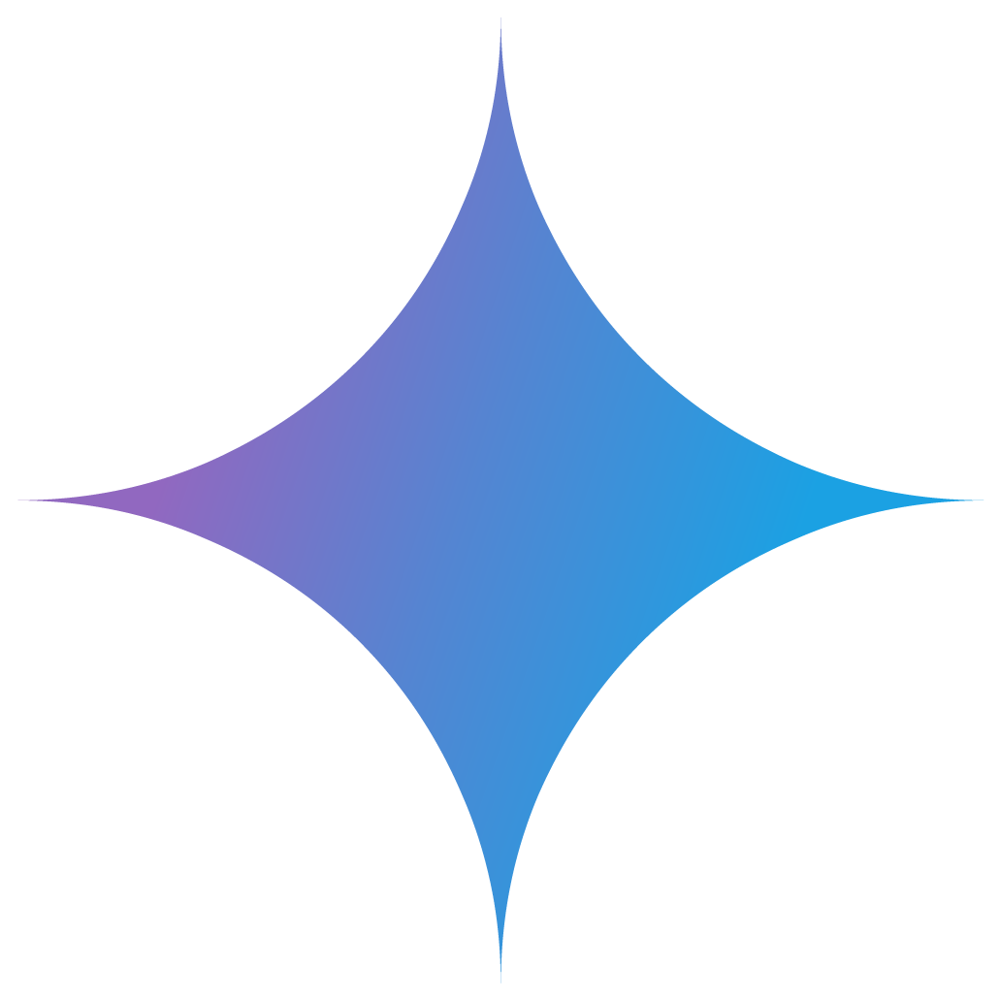
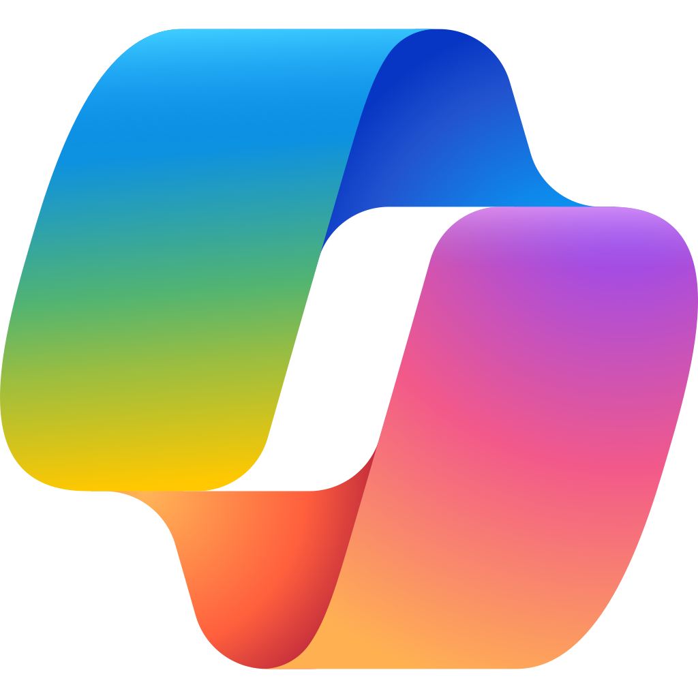
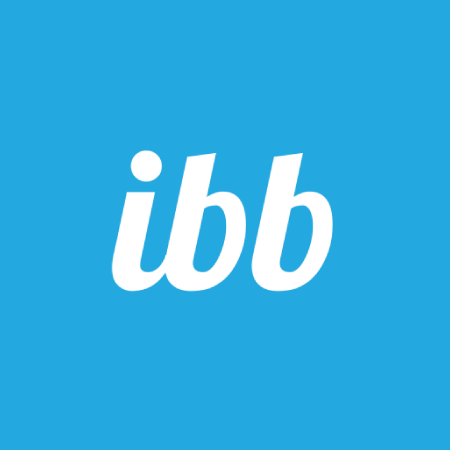

# **Ferramentas Utilizadas no Projeto**

## **Introdução**
As ferramentas apresentadas na Tabela 1 foram utilizadas com o intuito de facilitar a realização das atividades e produção dos conteúdos apresentados na disciplina **Requisitos de Software**.

## **Tabela de Contribuição**

| Nome     | Contribuição |
| :------- | :---------------: |
| Fernanda Vaz |      Desenvolvimento da Página       |
| Gabriel Maciel | Desenvolvimento da Página |
| João Gabriel  |      Desenvolvimento da Página       |
| João Ramos   |      Desenvolvimento da Página       |

## **Tabela de Ferramentas**

| Logo | Ferramenta | Finalidade |
|-------------------------------------------------------|------------|-----------------------------------------------|
|  | WhatsApp | Utilizado como principal canal de comunicação da equipe. <a id="anchor_1" href="#FRM1">1</a> |
|  | Google Docs | Criação e edição de arquivos de texto de maneira colaborativa entre os membros. <a id="anchor_2" href="#FRM2">2</a> |
|  | YouTube | Hospedagem dos vídeos produzidos pela equipe(reuniões e apresentações). <a id="anchor_3" href="#FRM3">3</a> |
|  | Discord | Canal alternativo de comunicação, e também usado para a realização de reuniões, além de permitir compartilhamento rápido de arquivos. <a id="anchor_4" href="#FRM4">4</a> |
|  | Microsoft Teams | Realização de reuniões mais formais, com possibilidade de gravação e posterior transcrição das mesmas. <a id="anchor_5" href="#FRM5">5</a> |
|  | OBS Studio | Utilizado para gravar as reuniões realizadas no Discord. <a id="anchor_6" href="#FRM6">6</a> |
|  | Visual Studio Code | Editor de código utilizado para criar e editar os arquivos de documentação do projeto. <a id="anchor_7" href="#FRM7">7</a> |
|  | Draw.io | Desenvolver diagramas e fluxogramas, como o Rich Picture. <a id="anchor_8" href="#FRM8">8</a> |
|  | Microsoft Excel | Organização de informações em planilhas para análise de dados. <a id="anchor_9" href="#FRM9">9</a> |
|  | GitHub | Permite o versionamento e organização do projeto, e o armazenamento da sua documentação, artefatos e rastreabilidade gerada. <a id="anchor_10" href="#FRM10">10</a> |
|  | MkDocs | Criação e publicação do site para documentação no GitHub Pages. <a id="anchor_11" href="#FRM11">11</a> |
|  | ChatGPT | Ferramenta de Inteligência Artificial Generativa utilizada para revisão gramatical e estilística dos textos do projeto, contribuindo para aprimorar a clareza, concisão e legibilidade dos conteúdos. <a id="anchor_12" href="#FRM12">12</a> |
|  | Google Gemini | Ferramenta de Inteligência Artificial Generativa utilizada para revisão gramatical e estilística dos textos do projeto, contribuindo para aprimorar a clareza, concisão e legibilidade dos conteúdos. <a id="anchor_13" href="#FRM13">13</a> |
|  | Microsoft Copilot | Ferramenta de Inteligência Artificial Generativa utilizada para revisão gramatical e estilística dos textos do projeto, contribuindo para aprimorar a clareza, concisão e legibilidade dos conteúdos. <a id="anchor_14" href="#FRM14">14</a> |
|  | ImgBB | Hospedagem e compartilhamento de imagens utilizadas na documentação do projeto. <a id="anchor_15" href="#FRM15">15</a> |
|  | Figma | Criação de protótipos de interface e designs colaborativos para o projeto. <a id="anchor_16" href="#FRM16">16</a> |
|  | Davinci Resolve | Edição de vídeo <a id="anchor_17" href="#FRM17">17</a> |

<b>Tabela 1</b> - Ferramentas Utilizadas no Projeto - Autores: Fernanda Vaz, Gabriel Maciel, João Gabriel, João Ramos

## **Referências Bibliograficas**
><a id="FRM1" href="#anchor_1">1.</a>  WhatsApp . Disponível em: [https://blog.whatsapp.com/whats-app-web?lang=pt_BR](). Acesso em: 07 de set. de 2025.

><a id="FRM2" href="#anchor_2">2.</a> Google Docs. Disponível em: [https://play.google.com/store/apps/details?id=com.google.android.apps.docs.editors.docs&hl=pt_BR](). Acesso em: 07 de set. de 2025.

><a id="FRM3" href="#anchor_3">3.</a> YouTube. Disponível em: [https://www.youtube.com/user/YouTubeBrasil](). Acesso em: 07 de set. de 2025.

><a id="FRM4" href="#anchor_4">4.</a> Discord. Disponível em: [https://discord.com/](). Acesso em: 09 de set. de 2025.

><a id="FRM5" href="#anchor_5">5.</a> Microsoft Teams. Disponível em: [https://www.microsoft.com/pt-br/microsoft-teams/group-chat-software](). Acesso em: 09 de set. de 2025.

><a id="FRM6" href="#anchor_6">6.</a> OBS Studio. Disponível em: [https://obsproject.com/pt-br](). Acesso em: 09 de set. de 2025.

><a id="FRM7" href="#anchor_7">7.</a> Visual Studio Code. Disponível em: [https://code.visualstudio.com/](). Acesso em: 09 de set. de 2025.

><a id="FRM8" href="#anchor_8">8.</a> Draw.io. Disponível em: [https://app.diagrams.net/](). Acesso em: 09 de set. de 2025.

><a id="FRM9" href="#anchor_9">9.</a> Microsoft Excel. Disponível em: [https://www.microsoft.com/pt-br/microsoft-365/excel](). Acesso em: 09 de set. de 2025.

><a id="FRM10" href="#anchor_10">10.</a> GitHub. Disponível em: [https://github.com/](). Acesso em: 09 de set. de 2025.

><a id="FRM11" href="#anchor_11">11.</a> MkDocs. Disponível em: [https://www.mkdocs.org/](). Acesso em: 09 de set. de 2025.

><a id="FRM12" href="#anchor_12">12.</a> ChatGPT. Disponível em: [https://chat.openai.com/](). Acesso em: 10 de set. de 2025.

><a id="FRM13" href="#anchor_13">13.</a> Google Gemini. Disponível em: [https://gemini.google.com/](). Acesso em: 10 de set. de 2025.

><a id="FRM14" href="#anchor_14">14.</a> Microsoft Copilot. Disponível em: [https://copilot.microsoft.com/](). Acesso em: 10 de set. de 2025.

><a id="FRM15" href="#anchor_15">15.</a> ImgBB. Disponível em: [https://imgbb.com/](). Acesso em: 10 de set. de 2025.

><a id="FRM16" href="#anchor_16">16.</a> Figma. Disponível em: [https://www.figma.com/](). Acesso em: 10 de set. de 2025.

><a id="FRM17" href="#anchor_17">16.</a> Davinci Resolve. Disponível em: [https://www.blackmagicdesign.com/br/products/davinciresolve](). Acesso em: 24 de nov. de 2025.

## **Histórico de Versões**

| Versão | Data | Descrição | Autor(es) | Revisor(es) |
|--------|------|-----------|-----------|-------------|
| 1.0 | 07/09/2025 | Criação da tabela de ferramentas  | [Fernanda Vaz](https://github.com/Fernandavazgit1) | [Fernanda Vaz ](https://github.com/Fernandavazgit1) |
| 1.1 | 09/09/2025 | Ajustes nas imagens dos ícones e adição de novas ferramentas. | [João Ramos](https://github.com/joaoramos) | [João Ramos](https://github.com/joaoramos) |
| 1.2 | 19/11/2025 | Adição das ferramentas ImgBB e Figma. | [João Gabriel](https://github.com/JoaoComTil) | [João Ramos](https://github.com/joaoramos) |
| 1.3 | 24/11/2024 | Adição da ferramenta Davinci Resolve | [Gabriel Maciel](https://github.com/GabrielMacielBR) | |

## **Agradecimentos**

>Agradecemos o suporte da ferramenta de Inteligência Artificial Generativa Google Gemini no desenvolvimento deste trabalho. Em conformidade com o Código de Conduta da Sociedade Brasileira de Computação (SBC), declaramos que a ferramenta foi utilizada como auxílio na revisão gramatical e estilística do texto, na sugestão de estrutura para seções específicas do artigo, bem como na formatação de tabelas e na descrição de figuras. Ressaltamos que os autores assumem total responsabilidade por todo o conteúdo apresentado, incluindo sua originalidade e precisão. A ferramenta não figura como autora desta publicação.
