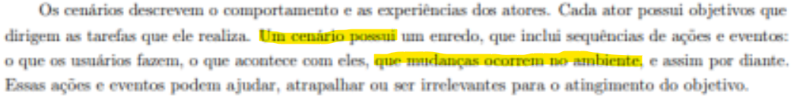
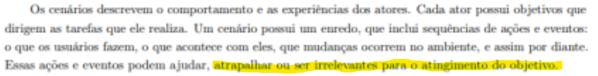
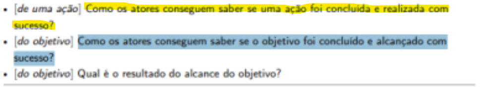
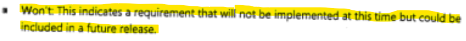
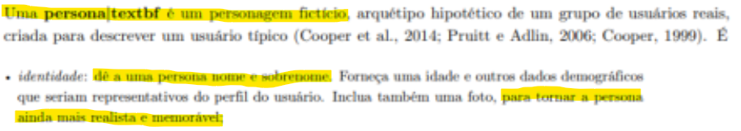
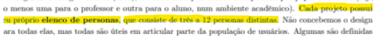
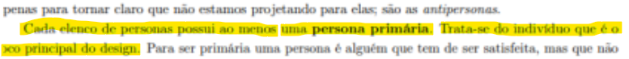

## Lista de verificação para Elicitação de Requisitos e Priorização

A elicitação de requisitos utiliza uma lista de verificação para garantir que as necessidades dos stakeholders sejam coletadas de forma clara e alinhada aos objetivos do negócio. Essa ferramenta ajuda a identificar conflitos e lacunas, além de auxiliar na priorização dos requisitos com base em critérios como valor, risco e viabilidade. O uso da lista organiza o processo e assegura decisões mais transparentes, favorecendo o sucesso do projeto.

# Lista de Verificação 

## Cenário

| Item | Avaliação | Avaliador(es) | Data e Hora |
|:-----|:----------|:--------------|:-------------|
| **01:** O cenário descreve o comportamento do autor? | A avaliar | Fernanda Vaz | 18/10/2025 17:16 |

  
**Fonte** ¹:**BARBOSA**, Simone D. J. et al. *Interação Humano-Computador e Experiência do Usuário. 1. ed.* Cáp. 8, p 172. [Cidade: Editora], **2021.**  

---

| Item | Avaliação | Avaliador(es) | Data e Hora |
|:-----|:----------|:--------------|:-------------|
| **02:** O cenário descreve as experiências dos autores? | A avaliar | Fernanda Vaz | 18/10/2025 17:16 |

  
**Fonte** ¹:**BARBOSA**, Simone D. J. et al. *Interação Humano-Computador e Experiência do Usuário. 1. ed.* Cáp. 8, p 172. [Cidade: Editora], **2021.**  

---

| Item | Avaliação | Avaliador(es) | Data e Hora |
|:-----|:----------|:--------------|:-------------|
| **03:** O cenário possui um enredo? | A avaliar | Fernanda Vaz | 18/10/2025 17:16 |

  
**Fonte** ¹:**BARBOSA**, Simone D. J. et al. *Interação Humano-Computador e Experiência do Usuário. 1. ed.* Cáp. 8, p 172. [Cidade: Editora], **2021.**  

---

| Item | Avaliação | Avaliador(es) | Data e Hora |
|:-----|:----------|:--------------|:-------------|
| **04:** O cenário possui um ambiente? | A avaliar | Fernanda Vaz | 18/10/2025 17:16 |

  
**Fonte** ¹:**BARBOSA**, Simone D. J. et al. *Interação Humano-Computador e Experiência do Usuário. 1. ed.* Cáp. 8, p 172. [Cidade: Editora], **2021.**  

---

| Item | Avaliação | Avaliador(es) | Data e Hora |
|:-----|:----------|:--------------|:-------------|
| **05:** O objetivo principal do cenário foi definido? | A avaliar | Fernanda Vaz | 18/10/2025 17:16 |

  
**Fonte** ¹:**BARBOSA**, Simone D. J. et al. *Interação Humano-Computador e Experiência do Usuário. 1. ed.* Cáp. 8, p 172. [Cidade: Editora], **2021.**  

---

| Item | Avaliação | Avaliador(es) | Data e Hora |
|:-----|:----------|:--------------|:-------------|
| **06:** Como os atores conseguem saber se uma ação foi concluída e realizada com sucesso? | A avaliar | Fernanda Vaz | 18/10/2025 17:16 |

  
**Fonte** ¹:**BARBOSA**, Simone D. J. et al. *Interação Humano-Computador e Experiência do Usuário. 1. ed.* Cáp. 8, p 175. [Cidade: Editora], **2021.**  

---

| Item | Avaliação | Avaliador(es) | Data e Hora |
|:-----|:----------|:--------------|:-------------|
| **07:** Como os atores conseguem saber se o objetivo foi concluído e alcançado com sucesso? | A avaliar | Fernanda Vaz | 18/10/2025 17:16 |

  
**Fonte** ¹:**BARBOSA**, Simone D. J. et al. *Interação Humano-Computador e Experiência do Usuário. 1. ed.* Cáp. 8, p 175. [Cidade: Editora], **2021.**  

---

## Elicitação de Requisitos

| Item | Avaliação | Avaliador(es) | Data e Hora |
|:-----|:----------|:--------------|:-------------|
| **08:** O protocolo do garçom (anotar, confirmar, validar) foi utilizado para evitar falhas de comunicação? | A avaliar | João Gabriel | 18/10/2025 17:16 |

  
**Fonte ¹:** **VALOREZ**, Carlos Edward. *Engenharia de Requisitos: Software Orientado ao Negócio.* p. 147. 

---

| Item | Avaliação | Avaliador(es) | Data e Hora |
|:-----|:----------|:--------------|:-------------|
| **09:** A elicitação foi tratada como um processo iterativo, integrado com a análise de requisitos? | A avaliar | João Gabriel | 18/10/2025 17:16 |

  
**Fonte ¹:** **VALOREZ**, Carlos Edward. *Engenharia de Requisitos: Software Orientado ao Negócio.* p. 140. 

---

| Item | Avaliação | Avaliador(es) | Data e Hora |
|:-----|:----------|:--------------|:-------------|
| **10:** Houve confirmação dos resultados da elicitação com as partes interessadas? | A avaliar | João Gabriel | 18/10/2025 17:16 |

  
**Fonte ¹:** **VALOREZ**, Carlos Edward. *Engenharia de Requisitos: Software Orientado ao Negócio.* p. 14. 

---

| Item | Avaliação | Avaliador(es) | Data e Hora |
|:-----|:----------|:--------------|:-------------|
| **11:** As entrevistas foram conduzidas com roteiro prévio e foco nos objetivos do projeto? | A avaliar | João Gabriel | 18/10/2025 17:16 |

  
**Fonte ¹:** **VALOREZ**, Carlos Edward. *Engenharia de Requisitos: Software Orientado ao Negócio.* p. 169.

---

| Item | Avaliação | Avaliador(es) | Data e Hora |
|:-----|:----------|:--------------|:-------------|
| **12:** Foram identificadas todas as partes interessadas relevantes para o projeto? | A avaliar | João Gabriel | 18/10/2025 17:16 |

  
**Fonte ¹:** **VALOREZ**, Carlos Edward. *Engenharia de Requisitos: Software Orientado ao Negócio.* p. 143.

---

## Priorização de Requisitos
| Item | Avaliação | Avaliador(es) | Data e Hora |
|:-----|:----------|:--------------|:-------------|
| **13:** O processo de priorização foi iterativo e revisitado ao longo do projeto? | A avaliar | João Gabriel | 18/10/2025 17:16 |

  
**Fonte ¹:** **WIEGERS**, Karl; BEATTY, Joy. *Software Requirements.* Capítulo 16, p. 315 

---

| Item | Avaliação | Avaliador(es) | Data e Hora |
|:-----|:----------|:--------------|:-------------|
| **14:** Foram considerados tanto o valor quanto o custo e o risco na priorização? | A avaliar | João Gabriel | 18/10/2025 17:16 |

  
**Fonte ¹:** **WIEGERS**, Karl; BEATTY, Joy. *Software Requirements.* Capítulo 16, p. 317

---

| Item | Avaliação | Avaliador(es) | Data e Hora |
|:-----|:----------|:--------------|:-------------|
| **15:** Foi evitada a "priorização por decibéis" (voz mais alta) ou "priorização por ameaça" (poder político)? | A avaliar | João Gabriel | 18/10/2025 17:16 |

  
**Fonte ¹:** **SILVA**, Reinaldo Antônio da. *NFR4ES: um Catálogo de Requisitos Não-Funcionais para Sistemas Embarcados*. **Recife**: Universidade Federal de Pernambuco, **2019**.

---

| Item | Avaliação | Avaliador(es) | Data e Hora |
|:-----|:----------|:--------------|:-------------|
| **16:** 	O "Must Have" foi validado como realmente indispensável para o sistema? | A avaliar | Cauã Nicolas | 18/10/2025 17:16 |

  
**Fonte ¹:** **SILVA**, Reinaldo Antônio da. *NFR4ES: um Catálogo de Requisitos Não-Funcionais para Sistemas Embarcados*. **Recife**: Universidade Federal de Pernambuco, **2019**.

---

| Item | Avaliação | Avaliador(es) | Data e Hora |
|:-----|:----------|:--------------|:-------------|
| **17:** 	O "Should Have" foi classificado como importante, mas não crítico para a primeira entrega? | A avaliar | Cauã Nicolas | 18/10/2025 17:16 |

  
**Fonte ¹:** **SILVA**, Reinaldo Antônio da. *NFR4ES: um Catálogo de Requisitos Não-Funcionais para Sistemas Embarcados*. **Recife**: Universidade Federal de Pernambuco, **2019**.

---

| Item | Avaliação | Avaliador(es) | Data e Hora |
|:-----|:----------|:--------------|:-------------|
| **18:** 	O "Could Have" foi avaliado como opcional e de baixo impacto se não implementado? | A avaliar | Cauã Nicolas | 18/10/2025 17:16 |

  
**Fonte ¹:** **SILVA**, Reinaldo Antônio da. *NFR4ES: um Catálogo de Requisitos Não-Funcionais para Sistemas Embarcados*. **Recife**: Universidade Federal de Pernambuco, **2019**.

---

| Item | Avaliação | Avaliador(es) | Data e Hora |
|:-----|:----------|:--------------|:-------------|
| **19:** 	O "Won't Have" foi documentado como itens descartados ou adiados? | A avaliar | Cauã Nicolas | 18/10/2025 17:16 |

  
**Fonte ¹:** **SILVA**, Reinaldo Antônio da. *NFR4ES: um Catálogo de Requisitos Não-Funcionais para Sistemas Embarcados*. **Recife**: Universidade Federal de Pernambuco, **2019**.

---

| Item | Avaliação | Avaliador(es) | Data e Hora |
|:-----|:----------|:--------------|:-------------|
| **20:** 	Os itens estão organizados como mais importante e menos importante? | A avaliar | Cauã Nicolas | 18/10/2025 17:16 |

  
**Fonte ¹:** **SILVA**, Reinaldo Antônio da. *NFR4ES: um Catálogo de Requisitos Não-Funcionais para Sistemas Embarcados*. **Recife**: Universidade Federal de Pernambuco, **2019**.

---

## Perfil de Usuário e Personas

| Item | Avaliação | Avaliador(es) | Data e Hora |
|:-----|:----------|:--------------|:-------------|
| **21:** Foi evitada a "priorização por decibéis" (voz mais alta) ou "priorização por ameaça" (poder político)? | A avaliar | João Gabriel | 18/10/2025 17:16 |

  
**Fonte ¹:** **SILVA**, Reinaldo Antônio da. *NFR4ES: um Catálogo de Requisitos Não-Funcionais para Sistemas Embarcados*. **Recife**: Universidade Federal de Pernambuco, **2019**.

---

| Item | Avaliação | Avaliador(es) | Data e Hora |
|:-----|:----------|:--------------|:-------------|
| **22:** A persona tem um nome fictício? | A avaliar | Gabriel Maciel | 18/10/2025 17:16 |

  
**Fonte ¹:** **SILVA**, Reinaldo Antônio da. *NFR4ES: um Catálogo de Requisitos Não-Funcionais para Sistemas Embarcados*. **Recife**: Universidade Federal de Pernambuco, **2019**.

---

| Item | Avaliação | Avaliador(es) | Data e Hora |
|:-----|:----------|:--------------|:-------------|
| **23:** A persona tem gênero definido? | A avaliar | Gabriel Maciel | 18/10/2025 17:16 |

  
**Fonte ¹:** **SILVA**, Reinaldo Antônio da. *NFR4ES: um Catálogo de Requisitos Não-Funcionais para Sistemas Embarcados*. **Recife**: Universidade Federal de Pernambuco, **2019**.

---

| Item | Avaliação | Avaliador(es) | Data e Hora |
|:-----|:----------|:--------------|:-------------|
| **24:** Os objetivos principais da persona estão listados?	 | A avaliar | Daniel Nunes | 18/10/2025 17:16 |

  
**Fonte ¹:** **SILVA**, Reinaldo Antônio da. *NFR4ES: um Catálogo de Requisitos Não-Funcionais para Sistemas Embarcados*. **Recife**: Universidade Federal de Pernambuco, **2019**.

---

| Item | Avaliação | Avaliador(es) | Data e Hora |
|:-----|:----------|:--------------|:-------------|
| **25:** As principais tarefas que a persona realiza foram listadas?	 | A avaliar | Daniel Nunes | 18/10/2025 17:16 |

  
**Fonte ¹:** **SILVA**, Reinaldo Antônio da. *NFR4ES: um Catálogo de Requisitos Não-Funcionais para Sistemas Embarcados*. **Recife**: Universidade Federal de Pernambuco, **2019**.

---

| Item | Avaliação | Avaliador(es) | Data e Hora |
|:-----|:----------|:--------------|:-------------|
| **26:** O elenco de personas possui de 3 a 12 participantes?		 | A avaliar | Daniel Nunes | 18/10/2025 17:16 |

  
**Fonte ¹:** **SILVA**, Reinaldo Antônio da. *NFR4ES: um Catálogo de Requisitos Não-Funcionais para Sistemas Embarcados*. **Recife**: Universidade Federal de Pernambuco, **2019**.

---

| Item | Avaliação | Avaliador(es) | Data e Hora |
|:-----|:----------|:--------------|:-------------|
| **27:** O elenco de personas possui uma persona primária?		 | A avaliar | João Ramos | 18/10/2025 17:16 |

  
**Fonte ¹:** **SILVA**, Reinaldo Antônio da. *NFR4ES: um Catálogo de Requisitos Não-Funcionais para Sistemas Embarcados*. **Recife**: Universidade Federal de Pernambuco, **2019**.

---
*Tabela 1: Lista verificação segunda etapa. Autores: Fernanda Vaz, João Gabriel, Gabriel Maciel, Cauã Nicolas e João Ramos e Daniel Nunes*

## Bibliografia

 >WIEGERS, Karl; BEATTY, Joy. *Software Requirements*. 3. ed. Redmond, WA: Microsoft Press, 2013.  
 >VALOREZ, Carlos Edward. *Engenharia de Requisitos: Software Orientado ao Negócio*. 1. ed. [São Paulo]: Editora Ciência Moderna, 2019.  
>BARBOSA, Simone D. J. et al. *Interação Humano-Computador e Experiência do Usuário*. 1. ed. [Cidade: Editora], 2021.

## Histórico de Versões

| Versão | Data       | Descrição                          | Autor(es)                | Revisor(es) |
|--------|------------|------------------------------------|--------------------------|-------------|
| 1.0    | 30/09/2025 | Criação da lista de verificação    | Fernanda, João Gabriel   | Fernanda, Cauã Nicolas    |
| 2.0    | 19/11/2025 | Alteração e correção de imagens da lista de verificação    | Cauã Nicolas   | João Ramos    |

## Agradecimentos
>>Agradecemos o suporte da ferramenta de Inteligência Artificial Generativa Google Gemini no desenvolvimento deste trabalho. Em conformidade com o Código de Conduta da Sociedade Brasileira de Computação (SBC), declaramos que a ferramenta foi utilizada como auxílio na revisão gramatical e estilística do texto, na sugestão de estrutura para seções específicas do artigo, bem como na formatação de tabelas e na descrição de figuras. Ressaltamos que os autores assumem total responsabilidade por todo o conteúdo apresentado, incluindo sua originalidade e precisão. A ferramenta não figura como autora desta publicação.
