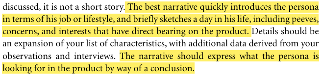
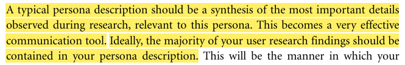
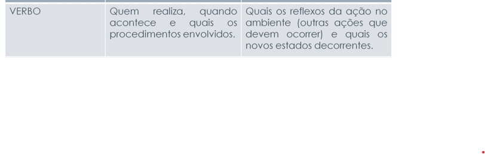
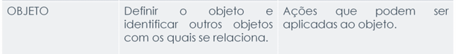
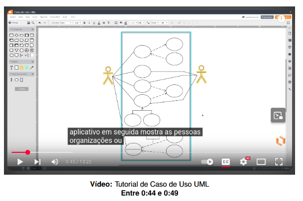
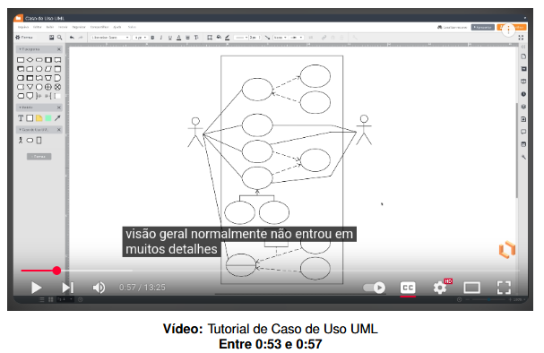
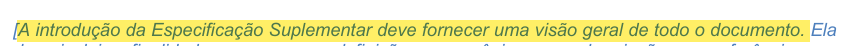
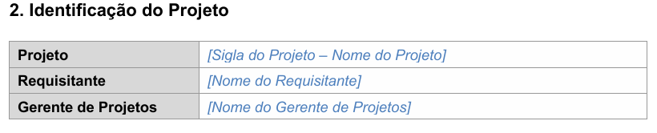

## Introdução
Uma lista de verificação, também conhecida como checklist, é uma ferramenta de organização que serve para reduzir falhas, garantir a consistência e aumentar a eficiência na execução de tarefas.

## Lista de Verificação Cenários

| Item | Avaliação | Avaliador(es) | Data e Hora |
|:-----|:----------|:--------------|:-------------------|
| **01:** O cenário possui um ambiente ou contexto?[(1)](#ref-1) | Aprovado | Fernanda Vaz | 09/10/2025 20:50 |
 **Print**
 
 
 ---

| Item | Avaliação | Avaliador(es) | Data e Hora |
|:-----|:----------|:--------------|:-------------------|
| **02:** O cenário possui atores?[(2)](#ref-1) | Aprovado | Fernanda Vaz | 09/10/2025 20:50 |
 **Print**

---

| Item | Avaliação | Avaliador(es) | Data e Hora |
|:-----|:----------|:--------------|:-------------------|
| **07:** A narrativa do cenário expressa, através das necessidades e objetivos do seu dia-a-dia, o que o ator busca no produto a ser desenvolvido? | Aprovado | Gabriel Maciel | 12/10/2025 21:00 |
 **Print**    **Fonte**: **COOPER**, Alan; **REIMANN**, Robert; **CRONIN**, Dave. *About Face 3: The Essentials of Interaction Design*. **Indianapolis**: Wiley Publishing, 2007. | 

---

| Item | Avaliação | Avaliador(es) | Data e Hora |
|:-----|:----------|:--------------|:-------------------|
| **08:** O ator descrito pelo cenário é derivado de informações de usuários reais (previamente obtidas no processo de desenvolvimento do perfil de usuário)? | Aprovado | Gabriel Maciel | 12/10/2025 21:00 |
 **Print**    **Fonte**: **BARBOSA**, Simone Diniz Junqueira *et al.* _Interação Humano-Computador e Experiência do Usuário_. **Rio de Janeiro**: Autopublicação, **2021**. p. **135–190**. |

## Lista de Verificação Léxicos
| Item | Avaliação | Avaliador(es) | Data e Hora |
|:-----|:----------|:--------------|:-------------------|
| **01:**O léxico possui** noção e impacto**?[(1)](#ref-2) | Aprovado | Fernanda Vaz | 09/10/2025 20:50 |
 **Print**
  

 ---

| Item | Avaliação | Avaliador(es) | Data e Hora |
|:-----|:----------|:--------------|:-------------------|
| **02:**O léxico possuium simbolo com zero ou mais sinônimo?[(2)](#ref-2) | Aprovado | Fernanda Vaz | 09/10/2025 20:50 |
 **Print**

---

| Item | Avaliação | Avaliador(es) | Data e Hora |
|:-----|:----------|:--------------|:-------------------|
| **07:** Os léxicos do tipo "verbo" representa uma ação clara e objetiva realizada por um ator ou sistema? | Aprovado | Gabriel Maciel | 12/10/2025 21:00 |
 **Print**  **Fonte**: **SERRANO**, Maurício; **SERRANO**, Milene. *Requisitos - Aula 10*. Material apresentado para a disciplina de **Requisitos de Software** no curso de **Engenharia de Software** da **UnB, FCTE**.
 |

---

| Item | Avaliação | Avaliador(es) | Data e Hora |
|:-----|:----------|:--------------|:-------------------|
| **08:** Os léxicos do tipo "objeto" é utilizado ou alterado por alguma ação realizada no sistema? | Aprovado | Gabriel Maciel | 12/10/2025 21:00 |
 **Print**  **Fonte**: **SERRANO**, Maurício; **SERRANO**, Milene. *Requisitos - Aula 10*. Material apresentado para a disciplina de **Requisitos de Software** no curso de **Engenharia de Software** da **UnB, FCTE**. |

---

## Lista de Verificação Casos de Uso
| Item | Avaliação | Avaliador(es) | Data e Hora |
|:-----|:----------|:--------------|:-------------------|
| **01:**O caso de uso possui atores?[(1)](#ref-3) | Aprovado | Fernanda Vaz | 09/10/2025 20:50 |
 **Print**

 ---

| Item | Avaliação | Avaliador(es) | Data e Hora |
|:-----|:----------|:--------------|:-------------------|
| **02:**O caso de uso possui Associações?[(2)](#ref-3) | Aprovado | Fernanda Vaz | 09/10/2025 20:50 |
 **Print**

---

| Item | Avaliação | Avaliador(es) | Data e Hora |
|:-----|:----------|:--------------|:-------------------|
| **07:** O diagrama de casos de uso UML apresenta o fluxo básico das funcionalidades do sistema? | Aprovado | Gabriel Maciel | 12/10/2025 21:00 |
 **Print**  |

---

| Item | Avaliação | Avaliador(es) | Data e Hora |
|:-----|:----------|:--------------|:-------------------|
| **08:** O diagrama de casos de uso UML apresenta o fluxo básico das funcionalidades do sistema? | Aprovado | Gabriel Maciel | 12/10/2025 21:00 |
 **Print**  |

## Lista de Verificação Especificação Suplementar
Item | Avaliação | Avaliador(es) | Data e Hora |
|:-----|:----------|:--------------|:-------------------|
| **01:** A Especificação Suplementar captura os requisitos de sistema?[(1)](#ref-4) | Aprovado | Fernanda Vaz | 09/10/2025 20:50 |
 **Print**
 

 ---

 Item | Avaliação | Avaliador(es) | Data e Hora |
|:-----|:----------|:--------------|:-------------------|
| **02:**A Especificação Suplementar possui analise de usabilidade?[(2)](#ref-4) | Aprovado | Fernanda Vaz | 09/10/2025 20:50 |
 **Print**
 
 
 ---

| Item | Avaliação | Avaliador(es) | Data e Hora |
|:-----|:----------|:--------------|:-------------------|
| **07:** A introdução da especificação suplementar dá uma visão geral do documento? | Aprovado | Gabriel Maciel | 12/10/2025 21:00 |
 **Print**    **Fonte:** **BRASIL**. **Ministério da Ciência, Tecnologia, Inovações e Comunicações**. **Secretaria-Executiva**. **Diretoria de Tecnologia da Informação**. **Coordenação Geral de Sistemas**. **Sigla do Projeto – Nome do Projeto: Especificação Suplementar**. Versão 1.0. Brasília: MCTIC, **[s.d.]**.
 |

---

| Item | Avaliação | Avaliador(es) | Data e Hora |
|:-----|:----------|:--------------|:-------------------|
| **08:** A seção de identificação do projeto especifica a sigla do projeto? | Aprovado | Gabriel Maciel | 12/10/2025 21:00 |
 **Print**  **Fonte:** **BRASIL**. **Ministério da Ciência, Tecnologia, Inovações e Comunicações**. **Secretaria-Executiva**. **Diretoria de Tecnologia da Informação**. **Coordenação Geral de Sistemas**. **Sigla do Projeto – Nome do Projeto: Especificação Suplementar**. Versão 1.0. Brasília: MCTIC, **[s.d.]**.|

--- 

# Lista de Verificação – Etapa 3  

| Nº | Item de Verificação | Avaliação (Conforme / Não Conforme / Não aplicável / Sugestão de Melhoria) | Data e Hora | Avaliação do (Grupo / Grupo +1) | Avaliadores |
|----|----------------------|---------------------------------------------------------------------------|--------------|----------------------------------|--------------|
| 1  | As especificações dos cenários para o projeto | Conforme | 12/10/2025 - 21:50 | Grupo | FERNANDA VAZ DUARTE DOS SANTOS |
| 2  | Os léxicos possuem os tipos verbo, objeto, estado? | Conforme | 12/10/2025 - 21:52 | Grupo | CAUA NICOLAS PEREIRA DE OLIVEIRA |
| 3  | Os léxicos possuem ligações entre si (hiperlinks)? | Conforme | 12/10/2025 - 21:50 | Grupo | GABRIEL MACIEL |
| 4  | O diagrama de Caso de Uso possui legenda explicando a notação? | Conforme | 12/10/2025 - 21:52 | Grupo +1 | JOAO LUCAS RAMOS DOS REIS |
| 5  | Há ao menos um caso de uso com pontos de extensão? | Conforme | 12/10/2025 - 21:50 | Grupo | JOAO GABRIEL MILHOMEM DE BRITO |
| 7  | A especificação do caso de uso contém todos os campos (Nome, Descrição, Atores, Pré/Pós-Condição, Fluxos etc.) preenchidos? | Conforme | 12/10/2025 - 21:52 | Grupo +1 | DANIEL NUNES DUARTE |
| 8  | Há gravação da participação do cliente/persona na validação dos Léxicos? | Conforme | 12/10/2025 - 21:50 | Grupo | FERNANDA VAZ DUARTE DOS SANTOS |
| 9  | Há gravação da participação do cliente/persona na validação dos Cenários? | Conforme | 12/10/2025 - 21:52 | Grupo +1 | CAUA NICOLAS PEREIRA DE OLIVEIRA |
| 10 | Há gravação da participação do cliente/persona na validação do Diagrama e da Especificação de Caso de Uso? | Conforme | 12/10/2025 - 21:50 | Grupo | GABRIEL MACIEL |
| 11 | Há gravação da participação do cliente/persona na validação da Especificação Suplementar? | Conforme | 12/10/2025 - 21:52 | Grupo +1 | JOAO GABRIEL MILHOMEM DE BRITO |
| 12 | Cada cenário é rastreável (possui requisito de origem e hiperlink)? | Conforme | 12/10/2025 - 21:50 | Grupo | JOAO LUCAS RAMOS DOS REIS |
| 13 | Cada especificação de Caso de Uso é rastreável (possui requisito de origem e hiperlink)? | Conforme | 12/10/2025 - 21:52 | Grupo +1 | DANIEL NUNES DUARTE |
| 14 | Cada RNF da Especificação Suplementar é rastreável (possui requisito de origem e hiperlink)? | Conforme | 12/10/2025 - 21:50 | Grupo | FERNANDA VAZ DUARTE DOS SANTOS |
| 15 | Todos os RNF da Especificação Suplementar são testáveis? | Conforme | 12/10/2025 - 21:52 | Grupo  | GABRIEL MACIEL |
| 16 | A Especificação Suplementar indica a plataforma e versão de execução do app? | Conforme | 12/10/2025 - 21:50 | Grupo | JOAO LUCAS RAMOS DOS REIS |
| 17 | Cada item da lista de verificação de Cenários possui referência com foto do texto de origem? | Conforme | 12/10/2025 - 21:52 | Grupo | CAUA NICOLAS PEREIRA DE OLIVEIRA |
| 18 | Cada item da lista de verificação de Diagrama de Caso de Uso possui referência com foto do texto de origem? | Conforme | 12/10/2025 - 21:50 | Grupo | JOAO GABRIEL MILHOMEM DE BRITO |
| 19 | Há item para verificar ator principal/secundário e explicação sobre a diferença? | Conforme | 12/10/2025 - 21:52 | Grupo | DANIEL NUNES DUARTE |
| 20 | Há item para verificar se o ator principal está à esquerda e há referência bibliográfica sobre isso? | Conforme | 12/10/2025 - 21:50 | Grupo | FERNANDA VAZ DUARTE DOS SANTOS |
| 21 | Cada item da lista de verificação da Especificação do Caso de Uso possui referência com foto do texto de origem? | Conforme | 12/10/2025 - 21:52 | Grupo  | JOAO LUCAS RAMOS DOS REIS |
| 22 | Cada item da lista de verificação da Especificação Suplementar possui referência com foto do texto de origem? | Conforme | 12/10/2025 - 21:50 | Grupo | GABRIEL MACIEL |
| 23 | A gravação da inspeção do próprio grupo e do grupo +1 foi realizada? | Conforme | 12/10/2025 - 21:52 | Grupo | CAUA NICOLAS PEREIRA DE OLIVEIRA |
| 24 | A lista de verificação dos Cenários possui referência bibliográfica e autor de cada item? | Conforme | 12/10/2025 - 21:50 | Grupo | DANIEL NUNES DUARTE |
| 25 | A lista de verificação do Diagrama e da Especificação de Caso de Uso possui referência bibliográfica e autor de cada item? | Conforme | 12/10/2025 - 21:52 | Grupo  | FERNANDA VAZ DUARTE DOS SANTOS |
| 26 | A lista de verificação da Especificação Suplementar possui referência bibliográfica e autor de cada item? | Conforme | 12/10/2025 - 21:50 | Grupo | JOAO GABRIEL MILHOMEM DE BRITO |
| 27 | Foi realizada a inspeção do grupo +1? | Conforme | 12/10/2025 - 21:52 | Grupo  | GABRIEL MACIEL |
| 28 | Há agradecimento informando o uso de IA Generativa no documento dos Léxicos? | Conforme | 12/10/2025 - 21:50 | Grupo | CAUA NICOLAS PEREIRA DE OLIVEIRA |
| 29 | Há agradecimento informando o uso de IA Generativa no documento dos Cenários? | Conforme | 12/10/2025 - 21:52 | Grupo | JOAO LUCAS RAMOS DOS REIS |
| 30 | Há agradecimento informando o uso de IA Generativa no documento da Especificação Suplementar? | Conforme | 12/10/2025 - 21:50 | Grupo | DANIEL NUNES DUARTE |

## Referência bibliográfica

> BARBOSA, Simone D. J.; SILVA, Bruno S. *Interação Humano-Computador.* Rio de Janeiro: Elsevier, 2010.

>SERRANO, Maurício; SERRANO, Milene. Requisitos - Aula 10. 35 slides. Material apresentado para a disciplina de Requisitos de Software no curso de Engenharia de Software da UnB, FCTE.

>Diagrama de caso de uso UML: O que é, como fazer e exemplos. Disponível em: <https://www.lucidchart.com/pages/pt/diagrama-de-caso-de-uso-uml>. Acesso em: 10 out. 2025.

>BRASIL. Ministério da Ciência, Tecnologia, Inovações e Comunicações. *Processo de Software do MCTIC: Documento Descritivo*. Brasília, DF: MCTIC, 2014. Disponível em: <https://ps.mctic.gov.br/MCTI-PS/workproducts/resources/PS_DocumentoDescritivo.pdf>. Acesso em: 7 out. 2025.

## Agradecimentos
>Os autores agradecem o auxílio da ferramenta de Inteligência Artificial Generativa (Google Gemini) no processo de revisão gramatical e estilística deste artigo. A tecnologia foi utilizada para aprimorar a clareza, a concisão e a legibilidade do texto, sendo que toda a responsabilidade pelo conteúdo final, precisão técnica e argumentação permanece integralmente dos autores.

