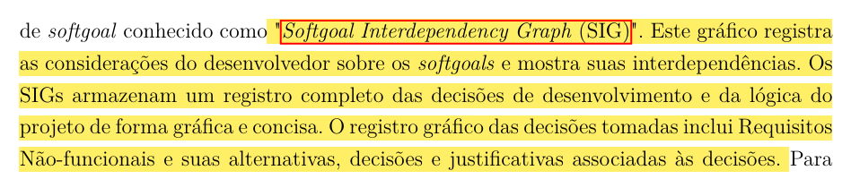
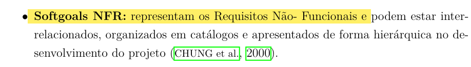

## Introdução

Uma lista de verificação, também conhecida como checklist, é uma ferramenta de organização que serve para reduzir falhas, garantir a consistência e aumentar a eficiência na execução de tarefas.

## Lista de Verificação NFR Framework

| Item | Avaliação | Avaliador(es) | Data e Hora |
|:-----|:----------|:--------------|:-------------------|
| **01:** O SIG (Softgoal Interdependency Graph) mostra softgoals, suas interdependências e considerações feitas pela equipe de desenvolvimento? | A avaliar | Gabriel Maciel | 18/10/2025 17:16 |

   **Fonte:** **SILVA**, Reinaldo Antônio da. *NFR4ES: um Catálogo de Requisitos Não-Funcionais para Sistemas Embarcados*. **Recife**: Universidade Federal de Pernambuco, **2019**.

| Item | Avaliação | Avaliador(es) | Data e Hora |
|:-----|:----------|:--------------|:-------------------|
| **02:** As softgoals do tipo NFR representam Requisitos Não-Funcionais? | A avaliar | Gabriel Maciel | 18/10/2025 17:16 |

    **Fonte:** **SILVA**, Reinaldo Antônio da. *NFR4ES: um Catálogo de Requisitos Não-Funcionais para Sistemas Embarcados*. **Recife**: Universidade Federal de Pernambuco, **2019**. 

## Lista de Verificação Histórias de Usuário

## Lista de Verificação Backlog