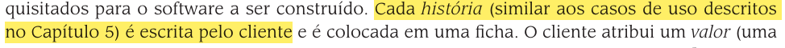
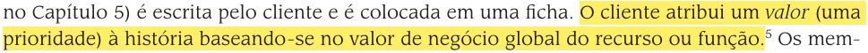
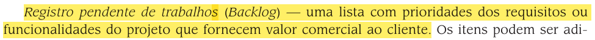
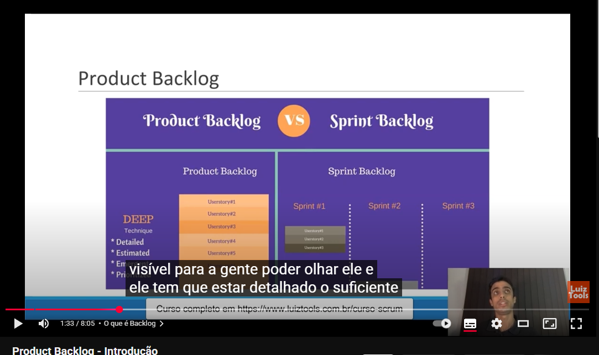

## Introdução

Uma lista de verificação, também conhecida como checklist, é uma ferramenta de organização que serve para reduzir falhas, garantir a consistência e aumentar a eficiência na execução de tarefas.

---

## Lista de Verificação: NFR Framework

| Item | Avaliação | Avaliador(es) | Data e Hora |
|:-----|:----------|:--------------|:-------------|
| **01:** O SIG (Softgoal Interdependency Graph) mostra softgoals, suas interdependências e considerações feitas pela equipe de desenvolvimento? | A avaliar | Gabriel Maciel | 18/10/2025 17:16 |

  
**Fonte ¹:** **SILVA**, Reinaldo Antônio da. *NFR4ES: um Catálogo de Requisitos Não-Funcionais para Sistemas Embarcados*. **Recife**: Universidade Federal de Pernambuco, **2019**.

| Item | Avaliação | Avaliador(es) | Data e Hora |
|:-----|:----------|:--------------|:-------------|
| **02:** As softgoals do tipo NFR representam Requisitos Não-Funcionais? | A avaliar | Gabriel Maciel | 18/10/2025 17:16 |

  
**Fonte ¹:** **SILVA**, Reinaldo Antônio da. *NFR4ES: um Catálogo de Requisitos Não-Funcionais para Sistemas Embarcados*. **Recife**: Universidade Federal de Pernambuco, **2019**.

---

| Item | Avaliação | Avaliador(es) | Data e Hora |
|:-----|:----------|:--------------|:-------------|
| **03:** Os Softgoals de Operacionalização representam soluções de implementação para satisfazer softgoals NFR ou outros softgoals de operacionalização? | A avaliar | Fernanda Vaz | 18/10/2025 19:00 |

  
**Fonte ¹:** **SILVA**, Reinaldo Antônio da. *NFR4ES: um Catálogo de Requisitos Não-Funcionais para Sistemas Embarcados*. **Recife**: Universidade Federal de Pernambuco, **2019**.

---

| Item | Avaliação | Avaliador(es) | Data e Hora |
|:-----|:----------|:--------------|:-------------|
| **04:** Existem três tipos de softgoals utilizados pelo NFR Framework? | A avaliar | Fernanda Vaz | 18/10/2025 19:00 |

  
**Fonte ¹:** **SILVA**, Reinaldo Antônio da. *NFR4ES: um Catálogo de Requisitos Não-Funcionais para Sistemas Embarcados*. **Recife**: Universidade Federal de Pernambuco, **2019**.

---

| Item | Avaliação | Avaliador(es) | Data e Hora |
|:-----|:----------|:--------------|:-------------|
| **05:** O Framework está usando métodos analíticos para auxiliar na decisão dos status dos softgoals? | A avaliar | Cauã Nicolas | 19/10/2025 19:10 |

  
**Fonte ¹:** **SILVA**, Reinaldo Antônio da. *NFR4ES: um Catálogo de Requisitos Não-Funcionais para Sistemas Embarcados*. **Recife**: Universidade Federal de Pernambuco, **2019**.

---

| Item | Avaliação | Avaliador(es) | Data e Hora |
|:-----|:----------|:--------------|:-------------|
| **06:** Os softgoals e seus correlacionados estão sendo representados em um grafo?  | A avaliar | Cauã Nicolas | 19/10/2025 19:12 |

  
**Fonte ¹:** **SILVA**, Reinaldo Antônio da. *NFR4ES: um Catálogo de Requisitos Não-Funcionais para Sistemas Embarcados*. **Recife**: Universidade Federal de Pernambuco, **2019**.

---

| Item | Avaliação | Avaliador(es) | Data e Hora |
|:-----|:----------|:--------------|:-------------|
| **07:** Os catálogos de requisitos estão descritos na notação adotada pelo NFR Framework? | A avaliar | João  Gabriel | 21/10/2025 15:45 |

  
**Fonte ¹:** **SILVA**, Reinaldo Antônio da. *NFR4ES: um Catálogo de Requisitos Não-Funcionais para Sistemas Embarcados*. **Recife**: Universidade Federal de Pernambuco, **2019**.

---

| Item | Avaliação | Avaliador(es) | Data e Hora |
|:-----|:----------|:--------------|:-------------|
| **08:** As contribuições entre softgoals foram claramente definidas? | A avaliar | João Gabriel | 21/10/2025 15:45 |

  
**Fonte ¹:** **SILVA**, Reinaldo Antônio da. *NFR4ES: um Catálogo de Requisitos Não-Funcionais para Sistemas Embarcados*. **Recife**: Universidade Federal de Pernambuco, **2019**.

---

| Item | Avaliação | Avaliador(es) | Data e Hora |
|:-----|:----------|:--------------|:-------------|
| **09:** O tipo específico de cada contribuição foi determinado? | A avaliar | Daniel Nunes Duarte | 21/10/2025 12:00 |

  
**Fonte ¹:** **SILVA**, Reinaldo Antônio da. *NFR4ES: um Catálogo de Requisitos Não-Funcionais para Sistemas Embarcados*. **Recife**: Universidade Federal de Pernambuco, **2019**.

---

| Item | Avaliação | Avaliador(es) | Data e Hora |
|:-----|:----------|:--------------|:-------------|
| **10:** O procedimento de análise para determinar o grau em que as decisões de projeto satisfazem os softgoals foi executado? | A avaliar | Daniel Nunes Duarte | 21/10/2025 12:00 |

  
**Fonte ¹:** **SILVA**, Reinaldo Antônio da. *NFR4ES: um Catálogo de Requisitos Não-Funcionais para Sistemas Embarcados*. **Recife**: Universidade Federal de Pernambuco, **2019**.

---

| Item | Avaliação | Avaliador(es) | Data e Hora |
|:-----|:----------|:--------------|:-------------|
| **11:** Rótulos de avaliação foram atribuídos aos softgoals? | A avaliar | Daniel Nunes Duarte | 21/10/2025 12:00 |

  
**Fonte ¹:** **SILVA**, Reinaldo Antônio da. *NFR4ES: um Catálogo de Requisitos Não-Funcionais para Sistemas Embarcados*. **Recife**: Universidade Federal de Pernambuco, **2019**.

---

| Item | Avaliação | Avaliador(es) | Data e Hora |
|:-----|:----------|:--------------|:-------------|
| **12:** Na priorização está ocorrendo o refinamento de um softgoal em outro softgoal com o mesmo tipo e tópicos? | A avaliar | Daniel Nunes Duarte | 21/10/2025 12:00 |

  
**Fonte ¹:** **SILVA**, Reinaldo Antônio da. *NFR4ES: um Catálogo de Requisitos Não-Funcionais para Sistemas Embarcados*. **Recife**: Universidade Federal de Pernambuco, **2019**.

---
| Item | Avaliação | Avaliador(es) | Data e Hora |
|:-----|:----------|:--------------|:-------------|
| **12:** O tipo de contribuição AND está determinando que se os softgoals descendentes forem satisfeitos os softgoals as-
cendentes serão satisfeitos? | João Ramos | 21/10/2025 21:00 |

  
**Fonte ¹:** **SILVA**, Reinaldo Antônio da. *NFR4ES: um Catálogo de Requisitos Não-Funcionais para Sistemas Embarcados*. **Recife**: Universidade Federal de Pernambuco, **2019**.
---
| Item | Avaliação | Avaliador(es) | Data e Hora |
|:-----|:----------|:--------------|:-------------|
| **12:** O tipo de contribuição OR está determinando que se algum softgoal descendente for satisfeito, o ascendente será
satisfeito? | A avaliar | João Ramos | 21/10/2025 21:00 |

  
**Fonte ¹:** **SILVA**, Reinaldo Antônio da. *NFR4ES: um Catálogo de Requisitos Não-Funcionais para Sistemas Embarcados*. **Recife**: Universidade Federal de Pernambuco, **2019**.
---

## Lista de Verificação: Histórias de Usuário

| Item | Avaliação | Avaliador(es) | Data e Hora |
|:-----|:----------|:--------------|:-------------|
| **01:** As histórias de usuário são escritas pelos clientes do software? | A avaliar | Gabriel Maciel | 18/10/2025 17:40 |

  
**Fonte ²:** **PRESSMAN, R. S.** *Engenharia de software: uma abordagem profissional*. 7. ed. Porto Alegre: AMGH, 2011.

| Item | Avaliação | Avaliador(es) | Data e Hora |
|:-----|:----------|:--------------|:-------------|
| **02:** O cliente atribuiu valor (uma prioridade) à história de usuário, levando em consideração o retorno que este recurso ou função trará para o negócio global? | A avaliar | Gabriel Maciel | 18/10/2025 17:43 |

  
**Fonte ²:** **PRESSMAN, R. S.** *Engenharia de software: uma abordagem profissional*. 7. ed. Porto Alegre: AMGH, 2011.

| Item | Avaliação | Avaliador(es) | Data e Hora |
|:-----|:----------|:--------------|:-------------|
| **03:** Cada história é escrita pelo cliente e é colocada em uma ficha? | A avaliar | Fernanda Vaz | 18/10/2025 19:00 |

  
**Fonte ²:** **PRESSMAN, R. S.** *Engenharia de software: uma abordagem profissional*. 7. ed. Porto Alegre: AMGH, 2011.

| Item | Avaliação | Avaliador(es) | Data e Hora |
|:-----|:----------|:--------------|:-------------|
| **04:** Clientes e desenvolvedores trabalham juntos para decidir como agrupar histórias para a versão seguinte? | A avaliar | Fernanda Vaz | 18/10/2025 19:00 |

  
**Fonte ²:** **PRESSMAN, R. S.** *Engenharia de software: uma abordagem profissional*. 7. ed. Porto Alegre: AMGH, 2011.

---

| Item | Avaliação | Avaliador(es) | Data e Hora |
|:-----|:----------|:--------------|:-------------|
| **05:** As histórias de usuário estão descrevendo o resultado para o software ser construído?  | A avaliar | Cauã Nicolas | 19/10/2025 19:30 |

  
**Fonte ²:** **PRESSMAN, R. S.** *Engenharia de software: uma abordagem profissional*. 7. ed. Porto Alegre: AMGH, 2011.

---

| Item | Avaliação | Avaliador(es) | Data e Hora |
|:-----|:----------|:--------------|:-------------|
| **06:** Em casos de histórias que requer um maior tempo de preparo, está sendo proposto ao cliente para que a história seja dividida em partes menores (histórias menores)?  | A avaliar | Cauã Nicolas | 19/10/2025 19:30 |

  
**Fonte ²:** **PRESSMAN, R. S.** *Engenharia de software: uma abordagem profissional*. 7. ed. Porto Alegre: AMGH, 2011.

---

| Item | Avaliação | Avaliador(es) | Data e Hora |
|:-----|:----------|:--------------|:-------------|
| **07:** A atividade de "Ouvir" conduz à criação de um conjunto de "histórias" que descrevem o resultado, as características e a funcionalidade requisitados para o software a ser construído? | A avaliar | João Gabriel | 21/10/2025 15:45 |

  
**Fonte ²:** **PRESSMAN, R. S.** *Engenharia de software: uma abordagem profissional*. 7. ed. Porto Alegre: AMGH, 2011. p. 88.

---

| Item | Avaliação | Avaliador(es) | Data e Hora |
|:-----|:----------|:--------------|:-------------|
| **08:** Os membros da equipe XP avaliam cada história e atribuem um custo — medido em semanas de desenvolvimento — a ela? | A avaliar | João Gabriel | 21/10/2025 15:45 |

  
**Fonte ²:** **PRESSMAN, R. S.** *Engenharia de software: uma abordagem profissional*. 7. ed. Porto Alegre: AMGH, 2011. p. 88.

---

| Item | Avaliação | Avaliador(es) | Data e Hora |
|:-----|:----------|:--------------|:-------------|
| **09:** As histórias de usuário foram escritas pelo cliente?  | A avaliar | João Ramos | 21/10/2025 19:45 |

  
**Fonte ⁴:** **SERRANO, Milene; SERRANO, Maurício.** *Requisitos – Aula 15*. Gama: Universidade de Brasília – UnB Gama, [2025]. Apresentação de slides da disciplina de Engenharia de Software.

---

| Item | Avaliação | Avaliador(es) | Data e Hora |
|:-----|:----------|:--------------|:-------------|
| **10:** O cliente atribui um valor a história de usuário baseado no valor do negócio?  | A avaliar | João Ramos | 19/10/2025 19:45 |

  
**Fonte ⁴:** **SERRANO, Milene; SERRANO, Maurício.** *Requisitos – Aula 15*. Gama: Universidade de Brasília – UnB Gama, [2025]. Apresentação de slides da disciplina de Engenharia de Software.

## Lista de Verificação: Backlog

| Item | Avaliação | Avaliador(es) | Data e Hora |
|:-----|:----------|:--------------|:-------------|
| **01:** O Backlog (Registro pendente de trabalhos) é uma lista que contém a priorização (baseada em retorno que o requisito/funcionalidade trará ao cliente e ao negócio) dos requisitos ou funcionalidades do projeto? | A avaliar | Gabriel Maciel | 18/10/2025 17:58 |

  
**Fonte ²:** **PRESSMAN, R. S.** *Engenharia de software: uma abordagem profissional*. 7. ed. Porto Alegre: AMGH, 2011.

| Item | Avaliação | Avaliador(es) | Data e Hora |
|:-----|:----------|:--------------|:-------------|
| **02:** Os itens do Backlog estão descritos de forma detalhada, conforme o princípio "Detailed" da técnica DEEP? | A avaliar | Gabriel Maciel | 18/10/2025 18:12 |

  
**Fonte ³:** LUIZTOOLS. *Product Backlog – Introdução*. YouTube, 5 out. 2020. (Entre 1:33 até 2:30)

| Item | Avaliação | Avaliador(es) | Data e Hora |
|:-----|:----------|:--------------|:-------------|
| **03:** O conteúdo da lista é definido pelo Product Owner? | A avaliar | Fernanda Vaz | 18/10/2025 19:00 |

  
**Fonte ⁴:** **SERRANO, Milene; SERRANO, Maurício.** *Requisitos – Aula 15*. Gama: Universidade de Brasília – UnB Gama, [2025]. Apresentação de slides da disciplina de Engenharia de Software.

| Item | Avaliação | Avaliador(es) | Data e Hora |
|:-----|:----------|:--------------|:-------------|
| **04:** O Product Backlog cresce e muda à medida que se aprende mais sobre o produto e seus usuários? | A avaliar | Fernanda Vaz | 18/10/2025 19:00 |

  
**Fonte ⁴:** **SERRANO, Milene; SERRANO, Maurício.** *Requisitos – Aula 15*. Gama: Universidade de Brasília – UnB Gama, [2025]. Apresentação de slides da disciplina de Engenharia de Software.

---

| Item | Avaliação | Avaliador(es) | Data e Hora |
|:-----|:----------|:--------------|:-------------|
| **05:** O Product Backlog cresce e muda à medida que se aprende mais sobre o produto e seus usuários? | A avaliar | Cauã Nicolas | 19/10/2025 19:45 |

  
**Fonte ⁴:** **SERRANO, Milene; SERRANO, Maurício.** *Requisitos – Aula 15*. Gama: Universidade de Brasília – UnB Gama, [2025]. Apresentação de slides da disciplina de Engenharia de Software.

---

| Item | Avaliação | Avaliador(es) | Data e Hora |
|:-----|:----------|:--------------|:-------------|
| **06:** No processo da Sprint Planning Meeting, o Product Owner está priorizando os itens do Product Backlog?  | A avaliar | Cauã Nicolas | 19/10/2025 19:45 |

  
**Fonte ⁴:** **SERRANO, Milene; SERRANO, Maurício.** *Requisitos – Aula 15*. Gama: Universidade de Brasília – UnB Gama, [2025]. Apresentação de slides da disciplina de Engenharia de Software.

---

| Item | Avaliação | Avaliador(es) | Data e Hora |
|:-----|:----------|:--------------|:-------------|
| **07:** Está informando a lista de funcionalidades do produto? | A avaliar | Daniel Duarte | 21/10/2025 12:30 |

  
**Fonte ³:** LUIZTOOLS. *Product Backlog – Introdução*. YouTube, 21 mar. 2020. (1:08m)

---

| Item | Avaliação | Avaliador(es) | Data e Hora |
|:-----|:----------|:--------------|:-------------|
| **08:** Está visível? | A avaliar | Daniel Duarte | 21/10/2025 12:30 |

  
**Fonte ³:** LUIZTOOLS. *Product Backlog – Introdução*. YouTube, 21 mar. 2020. (1:30m)

---

| Item | Avaliação | Avaliador(es) | Data e Hora |
|:-----|:----------|:--------------|:-------------|
| **09:** As informações para a próxima Sprint estão detalhadas? | A avaliar | Daniel Duarte | 21/10/2025 12:30 |

  
**Fonte ³:** LUIZTOOLS. *Product Backlog – Introdução*. YouTube, 21 mar. 2020. (2:03m)

---

| Item | Avaliação | Avaliador(es) | Data e Hora |
|:-----|:----------|:--------------|:-------------|
| **10:** Está priorizado com o que entrega mais valor para o cliente? | A avaliar | Daniel Duarte | 21/10/2025 12:30 |

  
**Fonte ³:** LUIZTOOLS. *Product Backlog – Introdução*. YouTube, 21 mar. 2020. (4:27m)

---

| Item | Avaliação | Avaliador(es) | Data e Hora |
|:-----|:----------|:--------------|:-------------|
| **11:** O backlog está sendo emergente? | A avaliar | Daniel Duarte | 21/10/2025 12:30 |

  
**Fonte ³:** LUIZTOOLS. *Product Backlog – Introdução*. YouTube, 21 mar. 2020. (3:31m)

---

| Item | Avaliação | Avaliador(es) | Data e Hora |
|:-----|:----------|:--------------|:-------------|
| **12:** Está de acordo com a necessidade do produto? | A avaliar | Daniel Duarte | 21/10/2025 12:30 |

  
**Fonte ⁴:** **SERRANO, Milene; SERRANO, Maurício.** *Requisitos – Aula 15a*. Brasília: Universidade de Brasília, [s.d.]. (pág. 5)

---

| Item | Avaliação | Avaliador(es) | Data e Hora |
|:-----|:----------|:--------------|:-------------|
| **13:** Foi definida pelo Product Owner (PO)? | A avaliar | Daniel Duarte | 21/10/2025 12:30 |

  
**Fonte ⁴:** **SERRANO, Milene; SERRANO, Maurício.** *Requisitos – Aula 15a*. Brasília: Universidade de Brasília, [s.d.]. (pág. 8)

---

| Item | Avaliação | Avaliador(es) | Data e Hora |
|:-----|:----------|:--------------|:-------------|
| **14:** A especificação dos itens está baseada em histórias de usuário, mais focadas em “o que” deve conter? | A avaliar | Daniel Duarte | 21/10/2025 12:30 |

  
**Fonte ⁴:** **SERRANO, Milene; SERRANO, Maurício.** *Requisitos – Aula 15a*. Brasília: Universidade de Brasília, [s.d.]. (pág. 11)

---

| Item | Avaliação | Avaliador(es) | Data e Hora |
|:-----|:----------|:--------------|:-------------|
| **15:** O Sprint Backlog está em forma de lista de tarefas ou “Taskboard”? | A avaliar | Daniel Duarte | 21/10/2025 12:30 |

  
**Fonte ⁴:** **SERRANO, Milene; SERRANO, Maurício.** *Requisitos – Aula 15a*. Brasília: Universidade de Brasília, [s.d.]. (pág. 17)

---

| Item | Avaliação | Avaliador(es) | Data e Hora |
|:-----|:----------|:--------------|:-------------|
| **16:** Os itens do Sprint Backlog foram extraídos do Product Backlog? | A avaliar | Daniel Duarte | 21/10/2025 12:30 |

  
**Fonte ⁴:** **SERRANO, Milene; SERRANO, Maurício.** *Requisitos – Aula 15a*. Brasília: Universidade de Brasília, [s.d.]. (pág. 17)

---

| Item | Avaliação | Avaliador(es) | Data e Hora |
|:-----|:----------|:--------------|:-------------|
| **17:** As Sprints estão ajustadas dentro do prazo pré-determinado? | A avaliar | Daniel Duarte | 21/10/2025 12:30 |

  
**Fonte ²:** **PRESSMAN, R. S.; MAXIM, B. R.** *Engenharia de software: uma abordagem profissional*. 8. ed. Porto Alegre: AMGH, 2016. (pág. 15)

---

| Item | Avaliação | Avaliador(es) | Data e Hora |
|:-----|:----------|:--------------|:-------------|
| **18:** A história do usuário foi uma manifestação explícita de requisitos? | A avaliar | Daniel Duarte | 21/10/2025 12:30 |

  
**Fonte ²:** **PRESSMAN, R. S.; MAXIM, B. R.** *Engenharia de software: uma abordagem profissional*. 8. ed. Porto Alegre: AMGH, 2016. (pág. 12)

---

| Item | Avaliação | Avaliador(es) | Data e Hora |
|:-----|:----------|:--------------|:-------------|
| **19:** O backlog é uma lista ordenada de tudo que pode ser necessário no produto? | A avaliar | João Gabriel | 21/10/2025 15:45 |

  
**Fonte ³:** LUIZTOOLS. *Product Backlog – Introdução*. YouTube, 5 out. 2020. (0:37m)

---

| Item | Avaliação | Avaliador(es) | Data e Hora |
|:-----|:----------|:--------------|:-------------|
| **20:** O backlog é a única fonte dos requisitos para qualquer mudança a ser feita no produto? | A avaliar | João Gabriel | 21/10/2025 15:45 |

  
**Fonte ³:** LUIZTOOLS. *Product Backlog – Introdução*. YouTube, 5 out. 2020. (0:42m)

| Item | Avaliação | Avaliador(es) | Data e Hora |
|:-----|:----------|:--------------|:-------------|
| **21:** O Product Backlog foi iniciado com os itens mais óbvios — medido em semanas de desenvolvimento — a ela? | A avaliar | João Lucas | 21/10/2025 21:00 |

  
**Fonte ²:** **PRESSMAN, R. S.** *Engenharia de software: uma abordagem profissional*. 7. ed. Porto Alegre: AMGH, 2011. p. 88.

| Item | Avaliação | Avaliador(es) | Data e Hora |
|:-----|:----------|:--------------|:-------------|
| **22:** O Product Backlog foi tratado como um artefato dinâmico que cresce conforme o conhecimento sobre o produto aumenta? | A avaliar | João Lucas | 21/10/2025 21:00 |

  
**Fonte ²:** **PRESSMAN, R. S.** *Engenharia de software: uma abordagem profissional*. 7. ed. Porto Alegre: AMGH, 2011. p. 88.

## Referências Bibliográficas

>  
¹ **SILVA**, Reinaldo Antônio da. *NFR4ES: um Catálogo de Requisitos Não-Funcionais para Sistemas Embarcados*. **Recife**: Universidade Federal de Pernambuco, **2019**.  

>  
² **PRESSMAN, R. S.** *Engenharia de software: uma abordagem profissional*. 7. ed. Porto Alegre: AMGH, 2011.  

>  
³ **LUIZTOOLS.** *Product Backlog – Introdução*. YouTube, 5 out. 2020. Disponível em: [https://www.youtube.com/watch?v=z4ubaBwjCsU](https://www.youtube.com/watch?v=z4ubaBwjCsU).  

>  
⁴ **SERRANO, Milene; SERRANO, Maurício.** *Requisitos – Aula 15*. Gama: Universidade de Brasília – UnB Gama, [2025]. Apresentação de slides da disciplina de Engenharia de Software.

---

## Histórico de Versões

| Versão | Data | Descrição | Autor(es) | Revisor(es) |
|:-------|:-----|:-----------|:------------|:-------------|
| 1.0 | 18/10/2025 | Criação da lista de verificação | Cauã Nicolas | Gabriel Maciel |
| 1.1 | 18/10/2025 | Adição de itens 1 e 2 das Listas de Verificação: NFR Framework, Histórias de Usuário e Backlog | Gabriel Maciel | Cauã Nicolas |
| 1.2 | 18/10/2025 | Adição de novos artefatos (itens 3 e 4) nas Listas de Verificação | Fernanda Vaz | Gabriel Maciel |
| 1.3 | 19/10/2025 | Adição de novos artefatos (itens 5 e 6) nas Listas de Verificação | Cauã Nicolas | Gabriel Maciel |
| 1.4 | 21/10/2025 | Adição dos novos itens 9–12 (NFR Framework) e 7–18 (Backlog) | Daniel Nunes Duarte | João Gabriel |
| 1.5 | 21/10/2025 | Adição dos novos itens  7-8 (NFR), 19-20(backlog) e 7-8 (Historias)| João Gabriel | Daniel Nunes |
| 1.6 | 21/10/2025 | Adição dos novos itens  nas LVs| João Lucas | Daniel Nunes |
