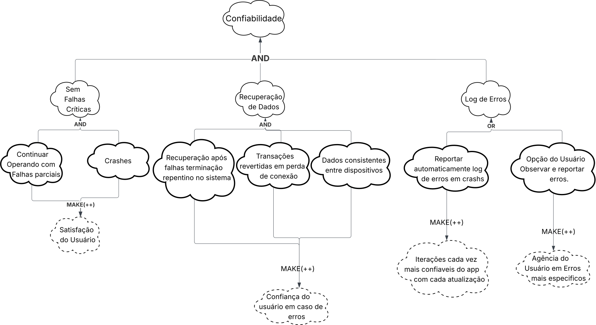

## Introdução
O NFR Framework (Framework de Requisitos Não Funcionais) é uma abordagem utilizada para representar e analisar RNF. Segundo Reinaldo Antônio [1](#ref-1), seu objetivo é auxiliar desenvolvedores a implementar soluções personalizadas. Essa abordagem considera as características específicas do sistema — como requisitos funcionais, não-funcionais, prioridades e carga de trabalho — para determinar as alternativas de desenvolvimento mais adequadas (CHUNG et al., 2000).

---

###### Print da Referência 

  
 
Figura 01 – NFR Framework.

---

## Softgoal Interdependency Graph
Segundo Reinaldo Antônio [1](#ref-1) o "Softgoal Interdependency Graph" (SIG) é um gráfico que registra as análises do desenvolvedor sobre os softgoals (objetivos não-funcionais) e mostra como eles dependem uns dos outros. Essencialmente, os SIGs armazenam todo o histórico das decisões de desenvolvimento e a lógica do projeto de forma visual e resumida.

Conforme Silva [1](#ref-1), após a construção de uma taxonomia de Requisitos Não-Funcionais, é iniciada a criação de um Catálogo de RNFs, organizando todos os requisitos encontrados com suas definições, atributos, restrições e exemplos. Nesta etapa é realizada a construção de um grafo de Interdependência de Softgoal - Softgoal Interdependency Graph (SIG) com os Requisitos Não-Funcionais, adotando a notação do NFR Framework proposto por Chung et al. (2000). Além disso, para a documentação detalhada dos requisitos, adota-se o Cartão de Especificação baseado no cartão (snowcard) do processo Volere (Robertson; Robertson, 2012), que permite a escrita de exemplos do catálogo em um contexto real do sistema. Este cartão foi utilizado por se adequar bem à abordagem de análise de requisitos não-funcionais.

### Cartão de Especificação de Requisitos

O Cartão de Especificação de Requisitos segue o padrão utilizado no NFR Framework para documentação detalhada de cada requisito não-funcional. Este cartão, baseado no processo Volere, estrutura-se com os seguintes campos:

| Campo | Descrição |
|-------|-----------|
| **Nr Requisito** | Um número sequencial para identificar o requisito |
| **Classificação** | Classificação do tipo de requisito |
| **Descrição** | Declaração única do significado do requisito |
| **Justificativa** | Justificativa sobre a criação do requisito |
| **Origem** | Origem do requisito (stakeholder, norma técnica, etc.) |
| **Critério de Ajuste** | Métrica do requisito que possa ser testada e que deve ser satisfeita |
| **Dependências** | Requisitos relacionados a este |
| **Prioridade** | Um número usado para decidir a importância relativa deste requisito entre os outros RNFs (varia de 1 a 10) |
| **Conflitos** | Requisitos conflitantes com este |
| **Histórico** | Data de criação e de modificações |

##### PRINT

---

### Tipos de Softgoal

Existem três tipos de softgoals: **Softgoals NFR**, **Softgoals de Operacionalização** e **Softgoals de Afirmação**. Estes são descritos a seguir:

- **Softgoals NFR:** representam os Requisitos Não Funcionais e podem estar interrelacionados, organizados em catálogos e apresentados de forma hierárquica no desenvolvimento do projeto (CHUNG et al., 2000).

- **Softgoals de Operacionalização:** representam soluções de implementação para satisfazer softgoals NFR ou outros softgoals de operacionalização. Essas soluções incluem operações, processos, representações de dados e restrições no sistema alvo (CHUNG et al., 2000).

- **Softgoals de Afirmação:** permitem que características do domínio (como prioridades e carga de trabalho) sejam consideradas e refletidas nas decisões de projeto, servindo como justificativas para apoiar ou negar escolhas (CHUNG et al., 2000).

  
 
Figura 02 – Tipos de Softgoal.

---

### Tipos de Decomposições

As decomposições refinam softgoals para obter outros mais especializados, auxiliando na construção do projeto. Os quatro tipos principais são:

- **Decomposição de Softgoal NFR:** subdivide um softgoal em outros mais específicos.  
- **Decomposição de Operacionalização:** refina soluções de implementação.  
- **Decomposição de Afirmação (Claims):** detalha justificativas específicas de projeto.  
- **Priorização:** refina um softgoal em outro do mesmo tipo, mas com prioridade associada.  

  
 
Figura 03 – Tipos de Decomposição.

---

### Contribuições

O **NFR Framework** permite diversos tipos de contribuições que descrevem como a satisfação (ou não) de um *softgoal* descendente afeta a satisfação de um *softgoal* ascendente:

- **AND:** todos os descendentes devem ser satisfeitos.  
- **OR:** basta um descendente satisfeito.  
- **MAKE (++)**: contribuição fortemente positiva.  
- **BREAK (--)**: contribuição fortemente negativa.  
- **HELP (+)**: contribuição parcialmente positiva.  
- **HURT (-)**: contribuição parcialmente negativa.  
- **UNKNOWN (?)**: efeito desconhecido.  
- **EQUALS:** relação de equivalência entre *softgoals*.  
- **SOME:** sinal conhecido, mas extensão incerta.

  
 
Figura 04 – Exemplos de Contribuições “AND” e “OR”.

  
 
Figura 05 – Exemplos de Contribuições “MAKE”, “BREAK”, “HELP” e “HURT”.

---

## SIG Usabilidade

*Autoria: Fernanda Vaz, 2025.*

Os softgoals de usabilidade foram extraídos dos Requisitos de usabilidade da Especificação Suplementar. O diagrama completo deste SIG pode ser visualizado na Figura 06.

<iframe allowfullscreen frameborder="0" style="width:640px; height:480px" src="https://lucid.app/documents/embedded/929a11a2-17f7-4526-93f0-3c97ddc4d236"></iframe>  
 
Figura 06 – Diagrama SIG Usabilidade.

---

### Requisitos Não-Funcionais do SIG Usabilidade
??? info "Requisitos Não-Funcionais do SIG - Usabilidade"

    | **ID** | **Descrição** |
    |:------:|:---------------|
    | **RU01** | Cidadãos devem conseguir utilizar funcionalidades básicas sem treinamento prévio. |
    | **RU02** | Oferecer resultados precisos para o usuário. |
    | **RU03** | A interface deve ser facilmente memorável para passageiros que usam ocasionalmente. |
    | **RU04** | A interface deve ser agradável e satisfatória de usar. |
    | **RU05** | Suporte a leitores de tela e ajuste de contraste conforme WCAG (Web Content Accessibility Guidelines). |
    | **RU06** | Mensagens de erro e confirmação devem ser claras e objetivas. |
    | **RU07** | Padrões visuais e de interação consistentes em todo o aplicativo. |
    | **RU08** | Permitir ajustes básicos de preferências visuais (tema, fonte, notificações). |
    | **RU09** | A interface deve ser adaptável para diferentes tipos de usuário (como usuários com deficiência visual, auditiva ou motora). |

### Cartão de Especificação de Requisitos Não-Funcionais do SIG Usabilidade

??? info "RU01 - Facilidade de Aprendizagem"

    ## Cartão de Especificação 01 Facilidade de Aprendizagem

    | **Campo** | **Descrição** |
    |-----------|---------------|
    | **Nr Requisito** | RU01 / RNF01 |
    | **Classificação** | Requisito Não-Funcional de Usabilidade - Facilidade de Aprendizagem |
    | **Descrição** | Cidadãos devem conseguir utilizar funcionalidades básicas sem treinamento prévio. |
    | **Justificativa** | É fundamental que o sistema permita que os usuários realizem suas operações de forma simples, sem que haja dificuldade durante o seu uso. Garantir acesso imediato às informações de transporte para usuários de diferentes níveis de alfabetização digital. |
    | **Origem** | Elicitação de Requisitos: Entrevista com usuários finais, Análise de usabilidade |
    | **Critério de Ajuste** | 90% dos novos usuários devem completar 3 tarefas básicas (consultar rota, ver horários, localizar parada) em até 5 minutos sem assistência; |
    | **Dependências** |Nenhum |
    | **Prioridade** | 10 |
    | **Conflitos** | Nenhum |
    | **Histórico** | Criado em 21/10/2025 — Autor: Fernanda Vaz |

---

??? info "RU02 - Eficiência e Precisão"

    ## Cartão de Especificação 02  Eficiência e Precisão"

    | **Campo** | **Descrição** |
    |-----------|---------------|
    | **Nr Requisito** | RU02 / RNF02 |
    | **Classificação** | Requisito Não-Funcional de Usabilidade - Eficiência e Precisão |
    | **Descrição** | O sistema deve oferecer resultados precisos para o usuário. |
    | **Justificativa** | A precisão das informações é crítica para que usuários possam planejar seus deslocamentos com confiança, evitando atrasos e frustrações causadas por dados incorretos ou desatualizados. |
    | **Origem** | Elicitação de Requisitos: Análise de reclamações dos usuários |
    | **Critério de Ajuste** | Precisão de rotas sugeridas ≥ 95%; Margem de erro em horários previstos ≤ 3 minutos; Taxa de reclamações sobre informações incorretas < 2%. |
    | **Dependências** | RNF-Desempenho, RNF-Integração |
    | **Prioridade** | 10 |
    | **Conflitos** | Nenhum |
    | **Histórico** | Criado em 21/10/2025 — Autor: Fernanda Vaz |

---

??? info "RU03 - Memorabilidade"

    ## Cartão de Especificação 03  Memorabilidade

    | **Campo** | **Descrição** |
    |-----------|---------------|
    | **Nr Requisito** | RU03 / RNF03 |
    | **Classificação** | Requisito Não-Funcional de Usabilidade - Memorabilidade |
    | **Descrição** | Interface deve ser facilmente memorável para passageiros que usam ocasionalmente. |
    | **Justificativa** | Usuários esporádicos (turistas, visitantes ocasionais) devem conseguir relembrar como usar o sistema sem necessidade de reaprender, aumentando a adoção e satisfação geral. |
    | **Origem** | Elicitação de Requisitos: entrevistas com usuários|
    | **Critério de Ajuste** | 85% dos usuários retornando após 30 dias devem completar tarefas sem consultar ajuda; Tempo de reaprendizagem < 2 minutos; NPS ≥ 70 para facilidade de uso. |
    | **Dependências** | Nenhum|
    | **Prioridade** | 8 |
    | **Conflitos** | Nenhum |
    | **Histórico** | Criado em 21/10/2025 — Autor: Fernanda Vaz|

---

??? info "RU04 - Satisfação do Usuário"

    ## Cartão de Especificação 04 Satisfação do Usuário

    | **Campo** | **Descrição** |
    |-----------|---------------|
    | **Nr Requisito** | RU04 / RNF04 |
    | **Classificação** | Requisito Não-Funcional de Usabilidade - Satisfação do Usuário |
    | **Descrição** | A interface deve ser agradável e satisfatória de usar. |
    | **Justificativa** | Uma experiência agradável aumenta a fidelização dos usuários, reduz resistência à adoção de tecnologia e melhora a percepção geral do serviço de transporte público. |
    | **Origem** | Analise de documentos |
    | **Critério de Ajuste** | System Usability Scale (SUS) ≥ 80 pontos; Avaliação média na loja de apps ≥ 4.5 estrelas; Taxa de satisfação em pesquisas ≥ 85%. |
    | **Dependências** | Nenhum|
    | **Prioridade** | 8 |
    | **Conflitos** | Nenhum |
    | **Histórico** | Criado em 21/10/2025 — Autor:Fernanda Vaz |

---

??? info "RU05 - Acessibilidade"

    ## Cartão de Especificação 05 Acessibilidade

    | **Campo** | **Descrição** |
    |-----------|---------------|
    | **Nr Requisito** | RU05 / RNF05 |
    | **Classificação** | Requisito Não-Funcional de Usabilidade - Acessibilidade |
    | **Descrição** | Suporte a leitores de tela e ajuste de contraste conforme WCAG (Web Content Accessibility Guidelines). |
    | **Justificativa** | Garantir inclusão digital e atendimento a requisitos legais (Lei Brasileira de Inclusão - LBI 13.146/2015), permitindo que pessoas com deficiência visual utilizem plenamente o sistema. |
    | **Origem** | Entrevistas e WCAG  |
    | **Critério de Ajuste** | Conformidade WCAG 2.1 Nível AA (100%); Razão de contraste ≥ 4.5:1 para textos normais e ≥ 3:1 para textos grandes; Teste com usuários PCD com taxa de sucesso ≥ 90%. |
    | **Dependências** |Nenhum |
    | **Prioridade** | 10 |
    | **Conflitos** | Nenhum |
    | **Histórico** | Criado em 21/10/2025 — Autor:Fernanda Vaz |

---

??? info "RU06 - Feedback e Comunicação"

    ## Cartão de Especificação 06 Feedback e Comunicação

    | **Campo** | **Descrição** |
    |-----------|---------------|
    | **Nr Requisito** | RU06 / RNF06 |
    | **Classificação** | Requisito Não-Funcional de Usabilidade - Feedback e Comunicação |
    | **Descrição** | Mensagens de erro e confirmação devem ser claras e objetivas. |
    | **Justificativa** | Feedback adequado reduz frustração, ajuda usuários a corrigir erros rapidamente e aumenta a confiança no sistema, especialmente para usuários menos experientes. |
    | **Origem** | Analise de documentos |
    | **Critério de Ajuste** | 95% das mensagens devem ser compreendidas sem necessidade de esclarecimento adicional; Linguagem em nível de leitura até 8º ano fundamental; Tempo médio para resolver erros < 30 segundos; Taxa de contato ao suporte por mensagens confusas < 5%. |
    | **Dependências** |Nenhum |
    | **Prioridade** | 9 |
    | **Conflitos** | Nenhum |
    | **Histórico** | Criado em 21/10/2025 — Autor: Fernanda Vaz |

---

??? info "RU07 - Consistência"
 
    ## Cartão de Especificação 07 Consistência

    | **Campo** | **Descrição** |
    |-----------|---------------|
    | **Nr Requisito** | RU07 / RNF07 |
    | **Classificação** | Requisito Não-Funcional de Usabilidade - Consistência |
    | **Descrição** | Padrões visuais e de interação consistentes em todo o aplicativo. |
    | **Justificativa** | Consistência facilita aprendizado, reduz carga cognitiva e aumenta a eficiência de uso, permitindo que usuários desenvolvam modelos mentais claros sobre o funcionamento do sistema. |
    | **Origem** | Entrevistas |
    | **Critério de Ajuste** | 100% conformidade com Design System estabelecido; Auditoria de consistência com score ≥ 95%; Mesmos padrões de cores, tipografia e espaçamento em todas as telas; Componentes reutilizáveis em ≥ 90% da interface. |
    | **Dependências** |Nenhum |
    | **Prioridade** | 9 |
    | **Conflitos** | Nenhum |
    | **Histórico** | Criado em 21/10/2025 — Autor: Fernanda Vaz |

---

??? info "RU08 - Personalização"

    ## Cartão de Especificação 08 Personalização

    | **Campo** | **Descrição** |
    |-----------|---------------|
    | **Nr Requisito** | RU08 / RNF08 |
    | **Classificação** | Requisito Não-Funcional de Usabilidade - Personalização |
    | **Descrição** | Permitir ajustes básicos de preferências visuais (tema, fonte, notificações). |
    | **Justificativa** | Personalização aumenta satisfação e acessibilidade, permitindo que usuários adaptem o sistema às suas preferências e necessidades específicas (ex: modo escuro, fontes maiores). |
    | **Origem** |  Feedback no google playstore|
    | **Critério de Ajuste** | Disponibilizar no mínimo: tema claro/escuro, 3 tamanhos de fonte, controle de notificações; Configurações salvas persistem entre sessões (100%); Tempo para aplicar preferências < 3 segundos; Taxa de uso de personalização ≥ 40%. |
    | **Dependências** | nenhum  |
    | **Prioridade** | 8 |
    | **Conflitos** | Possível conflito com RU07 (Consistência) se personalização excessiva fragmentar a experiência |
    | **Histórico** | Criado em 21/10/2025 — Autor: Fernanda Vaz |

---

---

#### RU09 - Adaptabilidade e Acessibilidade

| Campo | Descrição |
|-------|-----------|
| **Nr Requisito** | RU09 |
| **Classificação** | Requisito Não-Funcional de Usabilidade (Acessibilidade) |
| **Descrição** | A interface deve ser adaptável para diferentes tipos de usuário (como usuários com deficiência visual, auditiva ou motora). |
| **Justificativa** | Garantir a inclusão e permitir que todos os cidadãos, independentemente de suas habilidades, possam utilizar o aplicativo com autonomia. |
| **Origem** | Elicitação de Requisitos: Diretrizes de Acessibilidade (WCAG 2.1), Análise de Documentos. |
| **Critério de Ajuste** | - Conformidade com o nível AA da WCAG 2.1. - Compatibilidade total com leitores de tela (VoiceOver e TalkBack). - Contraste mínimo de 4.5:1 para textos e 3:1 para componentes de interface. - Áreas de toque com tamanho mínimo de 44x44 pixels. |
| **Dependências** | SIG-U03, OP-U03, OP-U04 |
| **Prioridade** | 10 |
| **Conflitos** | Pode conflitar com requisitos de design (estética) se não for bem planejado. |
| **Histórico** | Criado em 21/10/2025 — Autor: João Ramos |

---

## SIG Desempenho

*Autoria: Gabriel Maciel, 2025.*

Os softgoals de desempenho foram extraídos dos Requisitos de Desempenho (RD01-RD04) definidos na Especificação Suplementar. O diagrama completo deste SIG pode ser visualizado na Figura 07.

Figura 07 – Diagrama SIG Desempenho.

---

#### Softgoals NFR

A **Tabela 05** lista os softgoals NFR principais.

Tabela 05 – Softgoals NFR do SIG Desempenho.

| ID | Softgoal | Descrição |
|---|---|---|
| SIG-D01 | Desempenho | Garantir tempo de resposta e eficiência. |
| SIG-D02 | Tempo de Resposta Rápido | Operações concluídas em tempo aceitável. |
| SIG-D03 | Consumo Eficiente | Reduzir uso de bateria e dados móveis. |
| SIG-D04 | Múltiplos Usuários | Suportar vários usuários simultaneamente. |

---

#### Softgoals de Operacionalização

**Tabela 06** - Tabela de Especificação de Softgoals de Operacionalização do SIG Desempenho

Tabela 06 – Softgoals de Operacionalização do SIG Desempenho.

| ID | Operacionalização | Softgoal Pai | Descrição |
|---|---|---|---|
| OP-D01 | Rastreamento Otimizado | SIG-D02 | Implementar rastreamento de veículos com latência máxima de 20 segundos. |
| OP-D02 | Carregamento Rápido da Interface | SIG-D02 | Interface principal carrega em menos de 3 segundos. |
| OP-D03 | Redução de Requisições | SIG-D03 | Minimizar requisições de rede desnecessárias através de cache e sincronização eficiente. |
| OP-D04 | Compressão de Dados | SIG-D03 | Aplicar compressão em dados transmitidos para reduzir consumo de dados móveis. |
| OP-D05 | Tamanho Compacto da Aplicação | SIG-D03 | Manter o tamanho do aplicativo reduzido para economizar espaço de armazenamento em dispositivos com recursos limitados. |
| OP-D06 | Cache de Informações | SIG-D04 | Armazenar dados de linhas, paradas e horários localmente para reduzir carga de requisições ao servidor. |
| OP-D07 | Servidor Responsivo | SIG-D04 | Manter infraestrutura de servidor estável e responsiva para processar múltiplas requisições simultâneas de rastreamento e consulta. |

---

#### Softgoals de Afirmação

A **Tabela 07** especifica os softgoals de afirmação.

Tabela 07 – Softgoals de Afirmação do SIG Desempenho.

| ID | Afirmação | Softgoal Pai | Descrição |
|---|---|---|---|
| AF-D01 | Satisfação do Usuário | SIG-D02 | Usuários satisfeitos com a velocidade da aplicação. |
| AF-D02 | Funcionamento em Dispositivos Limitados | SIG-D03, SIG-D04 | Sistema funciona bem em smartphones com recursos reduzidos. |

---

#### Rastreabilidade

Tabela 08 – Rastreabilidade dos Softgoals do SIG Desempenho.

| Softgoal | Requisito Origem | Descendentes |
|---|---|---|
| SIG-D01 | RD01, RD02, RD03, RD04 | SIG-D02, SIG-D03, SIG-D04 |
| SIG-D02 | RD01, RD02 | OP-D01, OP-D02, AF-D01 |
| SIG-D03 | RD03 | OP-D03, OP-D04, OP-D05, AF-D02 |
| SIG-D04 | RD04 | OP-D06, OP-D07, AF-D02 |

---

### Cartão de Especificação de Requisitos Não-Funcionais do SIG Desempenho

#### RD01 - Rastreamento de Veículos em Tempo Real

| Campo | Descrição |
|-------|-----------|
| **Nr Requisito** | RD01 / RNF03 |
| **Classificação** | Requisito Não-Funcional de Desempenho |
| **Descrição** | O sistema deve rastrear a localização de ônibus em tempo real com latência máxima de 20 segundos entre atualizações. |
| **Justificativa** | Essencial para que passageiros recebam informações precisas sobre a proximidade de ônibus, permitindo melhor planejamento de trajetos. |
| **Origem** | Elicitação de Requisitos: Entrevista (ENT09, ENT13) |
| **Critério de Ajuste** | Latência máxima de 20 segundos; precisão de localização de ±50 metros. |
| **Dependências** | RF35, RD04 |
| **Prioridade** | 9 |
| **Conflitos** | Nenhum |
| **Histórico** | Criado em 21/10/2025 — Autor: Gabriel Maciel |

#### RD02 - Tempo de Carregamento Rápido

| Campo | Descrição |
|-------|-----------|
| **Nr Requisito** | RD02 / RNF06 |
| **Classificação** | Requisito Não-Funcional de Desempenho |
| **Descrição** | A interface mobile da aplicação deve ser carregada em no máximo 3 segundos em conexões 4G. |
| **Justificativa** | Melhor experiência do usuário e redução de abandono de uso do aplicativo devido a lentidão. |
| **Origem** | Elicitação de Requisitos: Entrevista (ENT17) |
| **Critério de Ajuste** | Tempo de carregamento ≤ 3 segundos; testado em dispositivos com conexão 3G/4G. |
| **Dependências** | OP-D02, RD03 |
| **Prioridade** | 8 |
| **Conflitos** | Nenhum |
| **Histórico** | Criado em 21/10/2025 — Autor: Gabriel Maciel |

#### RD03 - Consumo Eficiente de Bateria e Dados

| Campo | Descrição |
|-------|-----------|
| **Nr Requisito** | RD03 / RNF10 |
| **Classificação** | Requisito Não-Funcional de Desempenho |
| **Descrição** | O aplicativo deve consumir no máximo 5% da bateria por hora em uso ativo e ter tamanho máximo de 50MB, permitindo acesso a usuários com dispositivos antigos ou com planos de dados limitados. |
| **Justificativa** | Permitir acesso a usuários com dispositivos antigos ou com planos de dados limitados, expandindo o alcance do sistema e melhorando a experiência em redes com conectividade reduzida. |
| **Origem** | Elicitação de Requisitos: Entrevista (ENT17) |
| **Critério de Ajuste** | Consumo de bateria ≤ 5% por hora em uso ativo; tamanho do app ≤ 50MB. |
| **Dependências** | OP-D03, OP-D04, OP-D05 |
| **Prioridade** | 7 |
| **Conflitos** | Nenhum |
| **Histórico** | Criado em 21/10/2025 — Autor: Gabriel Maciel |

#### RD04 - Suporte a Múltiplos Usuários Simultâneos

| Campo | Descrição |
|-------|-----------|
| **Nr Requisito** | RD04 / RNF14 |
| **Classificação** | Requisito Não-Funcional de Desempenho |
| **Descrição** | Os dados de localização de ônibus devem ser sincronizados com o servidor em tempo real, com no máximo 15 segundos de latência. |
| **Justificativa** | Garantir que o sistema mantenha a qualidade de serviço mesmo durante picos de uso, como horários de pico de deslocamento. |
| **Origem** | Elicitação de Requisitos: Brainstorm (BRS15) |
| **Critério de Ajuste** | Suportar ≥ 10.000 usuários simultâneos; tempo de resposta ≤ 2 segundos mesmo em carga máxima. |
| **Dependências** | OP-D06, OP-D07, RD01, RD02 |
| **Prioridade** | 9 |
| **Conflitos** | Nenhum |
| **Histórico** | Criado em 21/10/2025  — Autor: Gabriel Maciel |

---

## SIG Portabilidade/Compatibilidade

*Autoria: Cauã Nicolas, 2025.*

Figura 08 – Diagrama SIG Portabilidade.

---

### Cartão de Especificação de Requisitos Não-Funcionais do SIG Portabilidade

#### RS01 - Funcionalidade e Responsividade em Navegadores Móveis

| Campo | Descrição |
|-------|-----------|
| **Nr Requisito** | RS01 |
| **Classificação** | Requisito do Sistema (Funcionalidade / Usabilidade) |
| **Descrição** | A aplicação deve ser funcional e responsiva em navegadores web de dispositivos móveis (celulares). |
| **Justificativa** | Garantir acesso amplo sem necessidade de instalação e assegurar boa experiência em dispositivos móveis. |
| **Origem** | Documento de requisitos / Entrevistas (RFxx) |
| **Critério de Ajuste** | - Layout adaptativo em telas de 320px a 1080px. - Elementos interativos acessíveis e tocáveis conforme WCAG; testes em 3 navegadores móveis principais. |
| **Dependências** | Depende de práticas de CSS responsivo, frameworks front-end e testes de usabilidade. |
| **Prioridade** | 9 |
| **Conflitos** | Pode conflitar com requisitos de desempenho se renderização for pesada. |
| **Histórico** | Criado em 21/10/2025 — Autor: Cauã Nicolas |

#### RS02 - Funcionamento Offline

| Campo | Descrição |
|-------|-----------|
| **Nr Requisito** | RS02 |
| **Classificação** | Requisito do Sistema (Disponibilidade / Operacionalidade) |
| **Descrição** | A aplicação deve funcionar mesmo sem conexão de internet para consulta a rotas salvas e horários. |
| **Justificativa** | Usuários em áreas com conectividade limitada precisam acessar informações básicas sem conexão. |
| **Origem** | Documento de requisitos / Entrevistas (RFxx) |
| **Critério de Ajuste** | - Dados essenciais (rotas e horários salvos) acessíveis offline. - Tempo de sincronização de dados ao reconectar ≤ 10s para atualizações incrementais. |
| **Dependências** | Implementação de cache local (IndexedDB/LocalStorage) e sincronização de dados. |
| **Prioridade** | 9 |
| **Conflitos** | Armazenamento local pode aumentar uso de espaço no dispositivo; segurança de dados offline. |
| **Histórico** | Criado em 21/10/2025 — Autor: Cauã Nicolas |

#### RS03 - Configuração de Notificações (Som e Vibração)

| Campo | Descrição |
|-------|-----------|
| **Nr Requisito** | RS03 |
| **Classificação** | Requisito do Sistema (Notificações / Usabilidade) |
| **Descrição** | O sistema de notificação com som e vibração deve estar devidamente configurável pelo usuário. |
| **Justificativa** | Permitir ao usuário adaptar notificações conforme preferências e necessidades (p.ex., modo silencioso). |
| **Origem** | Documento de requisitos / Entrevistas (RFxx) |
| **Critério de Ajuste** | - Usuário pode ativar/desativar som e vibração independentemente. - Preferências persistidas entre sessões. |
| **Dependências** | API de notificações do navegador/dispositivo; armazenamento de preferências do usuário. |
| **Prioridade** | 8 |
| **Conflitos** | Pode conflitar com políticas de plataforma sobre uso de som/vibração em segundo plano. |
| **Histórico** | Criado em 21/10/2025 — Autor: Cauã Nicolas |

#### RS04 - Compatibilidade com APIs Externas

| Campo | Descrição |
|-------|-----------|
| **Nr Requisito** | RS04 |
| **Classificação** | Requisito do Sistema (Integração) |
| **Descrição** | O sistema deve ser compatível com APIs externas de transporte público e serviços de geolocalização. |
| **Justificativa** | Integração com provedores externos é essencial para dados em tempo real e funcionalidade correta do app. |
| **Origem** | Documento de requisitos / Análise de APIs (RFxx) |
| **Critério de Ajuste** | - Suporte a formatos JSON/GeoJSON e autenticação via API keys/OAuth. - Testes de integração automatizados com provedores principais. |
| **Dependências** | Contratos/SLAs com provedores (BRB Mobilidade, APIs de mapas). |
| **Prioridade** | 9 |
| **Conflitos** | Dependência externa pode afetar disponibilidade; necessidade de adaptação a mudanças de API. |
| **Histórico** | Criado em 21/10/2025 — Autor: Cauã Nicolas |

#### RS05 - Ajuste Automático de Layout

| Campo | Descrição |
|-------|-----------|
| **Nr Requisito** | RS05 |
| **Classificação** | Requisito do Sistema (Usabilidade / Compatibilidade) |
| **Descrição** | A interface deve ajustar automaticamente os elementos visuais para diferentes resoluções de tela, mantendo legibilidade e usabilidade. |
| **Justificativa** | Garantir que usuários em dispositivos diversos tenham experiência consistente e legível. |
| **Origem** | Documento de requisitos / Entrevistas (RFxx) |
| **Critério de Ajuste** | - Tipografia e espaçamento adaptativos; elementos acessíveis em dispositivos pequenos. - Pontuação mínima em testes de usabilidade de 80% para tarefas básicas. |
| **Dependências** | Frameworks de UI responsiva, testes de usabilidade e guidelines WCAG. |
| **Prioridade** | 9 |
| **Conflitos** | Pode conflitar com limitações de layout em dispositivos muito pequenos; trade-offs entre detalhe e simplicidade. |
| **Histórico** | Criado em 21/10/2025 — Autor: Cauã Nicolas |

# SIG Confiabilidade

*Autoria: João Gabriel, 2025*

Os softgoals de confiabilidade foram extraídos dos Requisitos de Confiabilidade (RC01-RC07) definidos na Especificação Suplementar.

Figura 09 – Diagrama SIG Confiabilidade.

---

#### Softgoals NFR

A **Tabela 10** lista os softgoals NFR principais.

Tabela 10 – Softgoals NFR do SIG Confiabilidade.

| ID | Softgoal | Descrição |
|---|---|---|
| SIG-C01 | Confiabilidade | Garantir operação consistente e resiliente do sistema |
| SIG-C02 | Disponibilidade | Sistema deve operar sem falhas críticas |
| SIG-C03 | Tolerância a Falhas | Sistema deve continuar operando mesmo com falhas parciais |
| SIG-C04 | Recuperabilidade | Capacidade de recuperar dados e restabelecer operação após falhas |
| SIG-C05 | Estabilidade em Rede Instável | Funcionamento adequado em condições de conectividade intermitente |
| SIG-C06 | Atomicidade | Transações completadas integralmente ou revertidas sem estados parciais |
| SIG-C07 | Monitoramento | Sistema deve detectar e reportar falhas automaticamente |
| SIG-C08 | Consistência de Dados | Dados devem permanecer consistentes entre sessões e dispositivos |

---

#### Softgoals de Operacionalização

**Tabela 11** - Tabela de Especificação de Softgoals de Operacionalização do SIG Confiabilidade

Tabela 11 – Softgoals de Operacionalização do SIG Confiabilidade.

| ID | Operacionalização | Softgoal Pai | Descrição |
|---|---|---|---|
| OP-C01 | Sem Falhas Críticas | SIG-C02 | Implementar tratamento robusto para evitar falhas que impeçam uso do sistema |
| OP-C02 | Continuidade com Falhas Parciais | SIG-C03 | Manter funcionalidades essenciais mesmo com falhas em serviços secundários |
| OP-C03 | Recuperação de Dados | SIG-C04 | Restaurar dados e operação após falhas do sistema |
| OP-C04 | Transações Resilientes | SIG-C05, SIG-C06 | Garantir atomicidade mesmo em condições de rede instável |
| OP-C05 | Consistência entre Dispositivos | SIG-C08 | Sincronizar dados entre diferentes sessões e dispositivos |
| OP-C06 | Reporte Automático de Logs | SIG-C07 | Detectar e registrar falhas automaticamente para análise |
| OP-C07 | Reporte Manual por Usuário | SIG-C07 | Permitir que usuários reportem erros observados manualmente |

---

#### Softgoals de Afirmação

A **Tabela 12** especifica os softgoals de afirmação.

Tabela 12 – Softgoals de Afirmação do SIG Confiabilidade.

| ID | Afirmação | Softgoal Pai | Descrição |
|---|---|---|---|
| AF-C01 | Confiança do Usuário | SIG-C02, SIG-C03 | Usuários confiam no sistema para deslocamentos críticos |
| AF-C02 | Experiência Consistente | SIG-C04, SIG-C08 | Experiência uniforme independente de condições externas |
| AF-C03 | Resiliência Operacional | SIG-C05, SIG-C06 | Sistema mantém operação em cenários adversos |

---

#### Rastreabilidade

Tabela 13 – Rastreabilidade dos Softgoals do SIG Confiabilidade.

| Softgoal | Requisito Origem | Descendentes |
|---|---|---|
| SIG-C01 | RC01, RC02, RC03, RC04, RC05, RC06, RC07 | SIG-C02, SIG-C03, SIG-C04, SIG-C05, SIG-C06, SIG-C07, SIG-C08 |
| SIG-C02 | RC01 | OP-C01, AF-C01 |
| SIG-C03 | RC02 | OP-C02, AF-C01 |
| SIG-C04 | RC03 | OP-C03, AF-C02 |
| SIG-C05 | RC04 | OP-C04, AF-C03 |
| SIG-C06 | RC05 | OP-C04, AF-C03 |
| SIG-C07 | RC06 | OP-C06, OP-C07 |
| SIG-C08 | RC07 | OP-C05, AF-C02 |

---

### Cartão de Especificação de Requisitos Não-Funcionais do SIG Confiabilidade

#### RC01 - Operação sem Falhas Críticas

| Campo | Descrição |
|-------|-----------|
| **Nr Requisito** | RC01 / RNF16 |
| **Classificação** | Requisito Não-Funcional de Confiabilidade - Disponibilidade |
| **Descrição** | Sistema deve operar sem falhas críticas que impeçam o uso das funcionalidades principais |
| **Justificativa** | Garantir que usuários possam confiar no sistema para planejamento de deslocamentos essenciais |
| **Origem** | Elicitação de Requisitos: Especificação Suplementar - Categoria Confiabilidade |
| **Critério de Ajuste** | Uptime ≥ 99.5%; Zero falhas críticas em produção; MTBF ≥ 720 horas |
| **Dependências** | RF01, RF02, RF35 |
| **Prioridade** | 10 |
| **Conflitos** | Nenhum |
| **Histórico** | Criado em 21/10/2025 — Autor: João Gabriel |

#### RC02 - Operação com Falhas Parciais

| Campo | Descrição |
|-------|-----------|
| **Nr Requisito** | RC02 / RNF17 |
| **Classificação** | Requisito Não-Funcional de Confiabilidade - Tolerância a Falhas |
| **Descrição** | O sistema deve continuar operando mesmo com falhas parciais em serviços secundários |
| **Justificativa** | Manter funcionalidades críticas disponíveis mesmo quando serviços auxiliares falharem |
| **Origem** | Elicitação de Requisitos: Especificação Suplementar - Categoria Confiabilidade |
| **Critério de Ajuste** | Funcionalidades principais disponíveis com ≤ 1 serviço secundário offline; Degradação graciosa implementada |
| **Dependências** | RF13, RF14, RF15 |
| **Prioridade** | 9 |
| **Conflitos** | Nenhum |
| **Histórico** | Criado em 21/10/2025 — Autor: João Gabriel |

#### RC03 - Recuperação de Dados

| Campo | Descrição |
|-------|-----------|
| **Nr Requisito** | RC03 / RNF18 |
| **Classificação** | Requisito Não-Funcional de Confiabilidade - Recuperabilidade |
| **Descrição** | Capacidade de recuperar dados e restabelecer operação após falhas |
| **Justificativa** | Proteger dados do usuário contra perda e garantir rápida recuperação do sistema |
| **Origem** | Elicitação de Requisitos: Especificação Suplementar - Categoria Confiabilidade |
| **Critério de Ajuste** | RTO ≤ 1 hora; RPO ≤ 15 minutos; Backup automático a cada 24 horas |
| **Dependências** | RF15, RF24 |
| **Prioridade** | 9 |
| **Conflitos** | Nenhum |
| **Histórico** | Criado em 21/10/2025 — Autor: João Gabriel |

#### RC04 - Funcionamento com Rede Instável

| Campo | Descrição |
|-------|-----------|
| **Nr Requisito** | RC04 / RNF19 |
| **Classificação** | Requisito Não-Funcional de Confiabilidade - Estabilidade |
| **Descrição** | Funcionamento adequado em condições de rede instável com conectividade intermitente |
| **Justificativa** | Garantir usabilidade em áreas com cobertura irregular de internet |
| **Origem** | Elicitação de Requisitos: Especificação Suplementar - Categoria Confiabilidade |
| **Critério de Ajuste** | Funcionalidades offline disponíveis; Sincronização automática ao reconectar; Cache local de 48 horas |
| **Dependências** | RNF11, RF04, RF05 |
| **Prioridade** | 8 |
| **Conflitos** | Nenhum |
| **Histórico** | Criado em 21/10/2025 — Autor: João Gabriel |

#### RC05 - Atomicidade de Transações

| Campo | Descrição |
|-------|-----------|
| **Nr Requisito** | RC05 / RNF20 |
| **Classificação** | Requisito Não-Funcional de Confiabilidade - Atomicidade |
| **Descrição** | Transações devem ser completadas integralmente ou revertidas sem estados parciais |
| **Justificativa** | Evitar situações de inconsistência financeira e dados corrompidos |
| **Origem** | Elicitação de Requisitos: Especificação Suplementar - Categoria Confiabilidade |
| **Critério de Ajuste** | 100% das transações atômicas; Rollback automático em falhas; Log de todas as operações |
| **Dependências** | RF13, RF14 |
| **Prioridade** | 10 |
| **Conflitos** | Nenhum |
| **Histórico** | Criado em 21/10/2025 — Autor: João Gabriel |

#### RC06 - Detecção e Reporte de Falhas

| Campo | Descrição |
|-------|-----------|
| **Nr Requisito** | RC06 / RNF21 |
| **Classificação** | Requisito Não-Funcional de Confiabilidade - Monitoramento |
| **Descrição** | Sistema deve detectar e reportar falhas automaticamente em logs |
| **Justificativa** | Permitir identificação e correção proativa de problemas |
| **Origem** | Elicitação de Requisitos: Especificação Suplementar - Categoria Confiabilidade |
| **Critério de Ajuste** | Logging centralizado; Alertas automáticos para falhas críticas; Dashboard de monitoramento |
| **Dependências** | Todos os requisitos funcionais |
| **Prioridade** | 7 |
| **Conflitos** | Nenhum |
| **Histórico** | Criado em 21/10/2025 — Autor: João Gabriel |

#### RC07 - Consistência de Dados

| Campo | Descrição |
|-------|-----------|
| **Nr Requisito** | RC07 / RNF22 |
| **Classificação** | Requisito Não-Funcional de Confiabilidade - Consistência |
| **Descrição** | Dados devem permanecer consistentes entre diferentes sessões e dispositivos |
| **Justificativa** | Garantir experiência uniforme independente do dispositivo de acesso |
| **Origem** | Elicitação de Requisitos: Especificação Suplementar - Categoria Confiabilidade |
| **Critério de Ajuste** | Sincronização em tempo real; Resolução de conflitos; Consistência eventual ≤ 5 segundos |
| **Dependências** | RF15, RF24, RF37 |
| **Prioridade** | 8 |
| **Conflitos** | Nenhum |
| **Histórico** | Criado em 21/10/2025 — Autor: João Gabriel |

---

<iframe width="560" height="315" 
  src="https://www.youtube.com/embed/OPVuApWBT6k" 
  title="YouTube video player" 
  frameborder="0" 
  allow="accelerometer; autoplay; clipboard-write; encrypted-media; gyroscope; picture-in-picture; web-share" 
  allowfullscreen>
</iframe>

## Referência bibliográfica 

> 1. SILVA, Reinaldo Antônio da. **NFR4ES: um Catálogo de Requisitos Não-Funcionais para Sistemas Embarcados.** Recife: Universidade Federal de Pernambuco, 2019.

---

## Bibliografia 

> SANTOS, Fernanda Vaz Duarte dos. **Diagrama NFR Framework** [diagrama]. Lucidchart, 2025.  
> Disponível em: [https://lucid.app/lucidchart/929a11a2-17f7-4526-93f0-3c97ddc4d236](https://lucid.app/lucidchart/929a11a2-17f7-4526-93f0-3c97ddc4d236).  
> Acesso em: 19 out. 2025.

---

## Histórico de Versões

Tabela 09 – Histórico de Versões.

| Versão | Data | Descrição | Autor(es) | Revisor(es) |
|:-------:|:-----:|:-----------|:------------|:-------------|
| 1.0 | 18/10 | Adição do SIG Usabilidade e introdução | Fernanda Vaz | Gabriel Maciel |
| 1.1 | 20/10 | Adição do SIG Desempenho | Gabriel Maciel | Cauã Nicolas |
| 1.2 | 20/10 | Adição do SIG Portabilidade | Cauã Nicolas | Gabriel Maciel |
| 1.3 | 20/10 | Adição do SIG Acessibilidade | Fernanda vaz  | Gabriel Maciel |
| 1.4 | 21/10 | Adição de Cartões de Especificação dos RNFs do SIG Desempenho | Gabriel Maciel | Cauã Nicolas |
| 1.5 | 21/10 | Adição de Cartões de Especificação dos RNFs do SIG Portabilidade | Cauã Nicolas | Gabriel Maciel |
| 1.6 | 21/10 | Adição de Cartões de Especificação dos RNFs do SIG Usabilidade | João Ramos | Gabriel Maciel |

---

## Agradecimentos

Agradecemos o suporte da ferramenta de Inteligência Artificial Generativa Google Gemini no desenvolvimento deste trabalho.  
Em conformidade com o Código de Conduta da Sociedade Brasileira de Computação (SBC), declaramos que a ferramenta foi utilizada como auxílio na revisão gramatical e estilística, bem como na formatação e estruturação das tabelas e figuras.  
Os autores assumem total responsabilidade pelo conteúdo e originalidade do trabalho.  
A ferramenta **não figura como autora desta publicação**.
