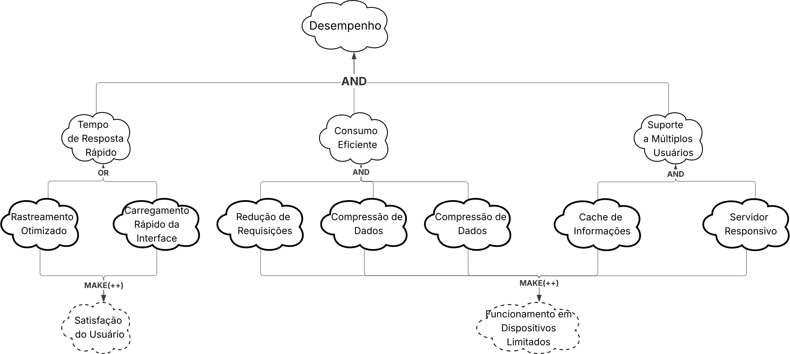

## Introdução
O NFR Framework (Framework de Requisitos Não Funcionais) é uma abordagem utilizada para representar e analisar RNF. Segundo Reinaldo Antônio [1](#ref-1), seu objetivo é auxiliar desenvolvedores a implementar soluções personalizadas. Essa abordagem considera as características específicas do sistema — como requisitos funcionais, não-funcionais, prioridades e carga de trabalho — para determinar as alternativas de desenvolvimento mais adequadas (CHUNG et al., 2000).

---

###### Print da Referência 

  
 
Figura 01 – NFR Framework.

---

## Softgoal Interdependency Graph
Segundo Reinaldo Antônio [1](#ref-1) o "Softgoal Interdependency Graph" (SIG) é um gráfico que registra as análises do desenvolvedor sobre os softgoals (objetivos não-funcionais) e mostra como eles dependem uns dos outros. Essencialmente, os SIGs armazenam todo o histórico das decisões de desenvolvimento e a lógica do projeto de forma visual e resumida.

---

### Tipos de Softgoal

Existem três tipos de softgoals: **Softgoals NFR**, **Softgoals de Operacionalização** e **Softgoals de Afirmação**. Estes são descritos a seguir:

- **Softgoals NFR:** representam os Requisitos Não Funcionais e podem estar interrelacionados, organizados em catálogos e apresentados de forma hierárquica no desenvolvimento do projeto (CHUNG et al., 2000).

- **Softgoals de Operacionalização:** representam soluções de implementação para satisfazer softgoals NFR ou outros softgoals de operacionalização. Essas soluções incluem operações, processos, representações de dados e restrições no sistema alvo (CHUNG et al., 2000).

- **Softgoals de Afirmação:** permitem que características do domínio (como prioridades e carga de trabalho) sejam consideradas e refletidas nas decisões de projeto, servindo como justificativas para apoiar ou negar escolhas (CHUNG et al., 2000).

  
 
Figura 02 – Tipos de Softgoal.

---

### Tipos de Decomposições

As decomposições refinam softgoals para obter outros mais especializados, auxiliando na construção do projeto. Os quatro tipos principais são:

- **Decomposição de Softgoal NFR:** subdivide um softgoal em outros mais específicos.  
- **Decomposição de Operacionalização:** refina soluções de implementação.  
- **Decomposição de Afirmação (Claims):** detalha justificativas específicas de projeto.  
- **Priorização:** refina um softgoal em outro do mesmo tipo, mas com prioridade associada.  

  
 
Figura 03 – Tipos de Decomposição.

---

### Contribuições

O **NFR Framework** permite diversos tipos de contribuições que descrevem como a satisfação (ou não) de um *softgoal* descendente afeta a satisfação de um *softgoal* ascendente:

- **AND:** todos os descendentes devem ser satisfeitos.  
- **OR:** basta um descendente satisfeito.  
- **MAKE (++)**: contribuição fortemente positiva.  
- **BREAK (--)**: contribuição fortemente negativa.  
- **HELP (+)**: contribuição parcialmente positiva.  
- **HURT (-)**: contribuição parcialmente negativa.  
- **UNKNOWN (?)**: efeito desconhecido.  
- **EQUALS:** relação de equivalência entre *softgoals*.  
- **SOME:** sinal conhecido, mas extensão incerta.

  
 
Figura 04 – Exemplos de Contribuições “AND” e “OR”.

  
 
Figura 05 – Exemplos de Contribuições “MAKE”, “BREAK”, “HELP” e “HURT”.

---

## SIG Usabilidade

*Autoria: Fernanda Vaz, 2025.*

Os softgoals de usabilidade foram extraídos dos Requisitos de usabilidade da Especificação Suplementar. O diagrama completo deste SIG pode ser visualizado na Figura 06.

<iframe allowfullscreen frameborder="0" style="width:640px; height:480px" src="https://lucid.app/documents/embedded/929a11a2-17f7-4526-93f0-3c97ddc4d236"></iframe>  
 
Figura 06 – Diagrama SIG Usabilidade.

---

### Especificação dos Softgoals do SIG Usabilidade

#### Softgoals NFR

Tabela 01 – Softgoals NFR do SIG Usabilidade.

| ID | Softgoal | Descrição |
|---|---|---|
| SIG-U01 | Usabilidade | Garantir que o sistema seja acessível e utilizável por todos os usuários. |
| SIG-U02 | Facilidade de Uso | Interface intuitiva e fácil de navegar. |
| SIG-U03 | Acessibilidade | Atender pessoas com deficiências visuais, auditivas e motoras. |
| SIG-U04 | Satisfação do Usuário | Proporcionar experiência positiva. |

---

#### Softgoals de Operacionalização

Tabela 02 – Softgoals de Operacionalização do SIG Usabilidade.

| ID | Operacionalização | Softgoal Pai | Descrição |
|---|---|---|---|
| OP-U01 | Cores de alto contraste | SIG-U02 | Facilitar leitura e visibilidade. |
| OP-U02 | Interface intuitiva | SIG-U02 | Navegação clara e ícones reconhecíveis. |
| OP-U03 | Leitores de tela nativos | SIG-U03 | Compatível com TalkBack e VoiceOver. |
| OP-U04 | Modo alto contraste | SIG-U03 | Acessibilidade visual. |
| OP-U05 | Promover eficiência | SIG-U04 | Funcionalidades úteis e objetivas. |
| OP-U06 | Feedback do usuário | SIG-U04 | Coletar avaliações para melhorias. |

---

#### Softgoals de Afirmação

Tabela 03 – Softgoals de Afirmação do SIG Usabilidade.

| ID | Afirmação | Softgoal Pai | Descrição |
|---|---|---|---|
| AF-U01 | Promove utilidade e eficiência | SIG-U04 | Interface eficiente aumenta a satisfação. |

---

#### Rastreabilidade

Tabela 04 – Rastreabilidade dos Softgoals do SIG Usabilidade.

| Softgoal | Requisito Origem | Descendentes |
|---|---|---|
| SIG-U01 | RA01, RA02, RA03 | SIG-U02, SIG-U03, SIG-U04 |
| SIG-U02 | RA01 | OP-U01, OP-U02 |
| SIG-U03 | RA02, RA03 | OP-U03, OP-U04 |
| SIG-U04 | RA01, RA02, RA03 | OP-U05, OP-U06, AF-U01 |

---

## SIG Desempenho

*Autoria: Gabriel Maciel, 2025.*

Figura 07 – Diagrama SIG Desempenho.

---

#### Softgoals NFR

Tabela 05 – Softgoals NFR do SIG Desempenho.

| ID | Softgoal | Descrição |
|---|---|---|
| SIG-D01 | Desempenho | Garantir tempo de resposta e eficiência. |
| SIG-D02 | Tempo de Resposta Rápido | Operações concluídas em tempo aceitável. |
| SIG-D03 | Consumo Eficiente | Reduzir uso de bateria e dados móveis. |
| SIG-D04 | Múltiplos Usuários | Suportar vários usuários simultaneamente. |

---

#### Operacionalização

Tabela 06 – Softgoals de Operacionalização do SIG Desempenho.

| ID | Operacionalização | Softgoal Pai | Descrição |
|---|---|---|---|
| OP-D01 | Rastreamento Otimizado | SIG-D02 | Latência máxima de 20s. |
| OP-D02 | Carregamento Rápido | SIG-D02 | Interface principal em até 3s. |
| OP-D03 | Cache de Requisições | SIG-D03 | Minimizar requisições redundantes. |
| OP-D04 | Compressão de Dados | SIG-D03 | Reduzir consumo de rede. |
| OP-D05 | Tamanho Compacto | SIG-D03 | Reduzir tamanho do app. |
| OP-D06 | Cache Local | SIG-D04 | Armazenar dados de paradas localmente. |
| OP-D07 | Servidor Responsivo | SIG-D04 | Suporte simultâneo a múltiplas conexões. |

---

#### Afirmação

Tabela 07 – Softgoals de Afirmação do SIG Desempenho.

| ID | Afirmação | Softgoal Pai | Descrição |
|---|---|---|---|
| AF-D01 | Satisfação do Usuário | SIG-D02 | Usuários satisfeitos com a velocidade. |
| AF-D02 | Dispositivos Limitados | SIG-D03, SIG-D04 | Sistema funcional em dispositivos simples. |

---

#### Rastreabilidade

Tabela 08 – Rastreabilidade dos Softgoals do SIG Desempenho.

| Softgoal | Requisito Origem | Descendentes |
|---|---|---|
| SIG-D01 | RD01–RD04 | SIG-D02, SIG-D03, SIG-D04 |
| SIG-D02 | RD01, RD02 | OP-D01, OP-D02, AF-D01 |
| SIG-D03 | RD03 | OP-D03, OP-D04, OP-D05, AF-D02 |
| SIG-D04 | RD04 | OP-D06, OP-D07, AF-D02 |

---

## SIG Portabilidade/Compatibilidade

*Autoria: Cauã Nicolas, 2025.*

Figura 08 – Diagrama SIG Portabilidade.

---

## Referência bibliográfica 

> 1. SILVA, Reinaldo Antônio da. **NFR4ES: um Catálogo de Requisitos Não-Funcionais para Sistemas Embarcados.** Recife: Universidade Federal de Pernambuco, 2019.

---

## Bibliografia 

> SANTOS, Fernanda Vaz Duarte dos. **Diagrama NFR Framework** [diagrama]. Lucidchart, 2025.  
> Disponível em: [https://lucid.app/lucidchart/929a11a2-17f7-4526-93f0-3c97ddc4d236](https://lucid.app/lucidchart/929a11a2-17f7-4526-93f0-3c97ddc4d236).  
> Acesso em: 19 out. 2025.

---

## Histórico de Versões

Tabela 09 – Histórico de Versões.

| Versão | Data | Descrição | Autor(es) | Revisor(es) |
|:-------:|:-----:|:-----------|:------------|:-------------|
| 1.0 | 18/10 | Adição do SIG Usabilidade e introdução | Fernanda Vaz | Gabriel Maciel |
| 1.1 | 20/10 | Adição do SIG Desempenho | Gabriel Maciel | Cauã Nicolas |
| 1.2 | 20/10 | Adição do SIG Portabilidade | Cauã Nicolas |  |
| 1.3 | 20/10 | Adição do SIG Acessibilidade | Fernanda vaz  | — |
---

## Agradecimentos

>>Agradecemos o suporte da ferramenta de Inteligência Artificial Generativa Google Gemini no desenvolvimento deste trabalho.  
Em conformidade com o Código de Conduta da Sociedade Brasileira de Computação (SBC), declaramos que a ferramenta foi utilizada como auxílio na revisão gramatical e estilística, bem como na formatação e estruturação das tabelas e figuras.  
Os autores assumem total responsabilidade pelo conteúdo e originalidade do trabalho.  
A ferramenta **não figura como autora desta publicação**.
