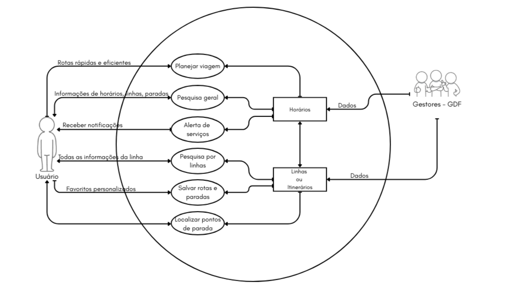
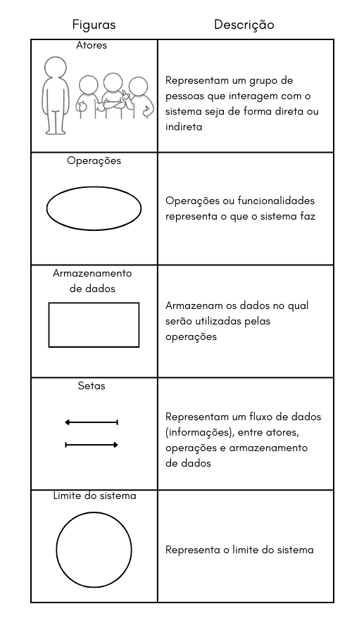

# Rich Picture

# Introdução 

Rich Picture é uma ferramenta eficaz para analisar problemas e expressar ideias. Ao desenvolver uma solução para um problema de negócios, é essencial entender
os componentes vitais desse problema. O rich picture pode ajudar a identificar:
- Processos de negócios e seus requisitos de dados
- Os atores envolvidos nos processos e suas responsabilidades
- As relações entre processos e atores
- Potenciais problemas e conflitos

# Sobre o aplicativo
O DF NO PONTO é uma iniciativa do Governo do Distrito Federal – GDF, criada para facilitar o dia a dia do cidadão. Este guia inteligente oferece informações atualizadas sobre os meios de transporte público, ajudando você a planejar a melhor rota e chegar ao seu destino com mais praticidade e tranquilidade.

# DF No Ponto

*Imagem 1: Rich Picture do DF No Ponto (Fonte: OLIVEIRA, Cauã. 2025)*

*Imagem 2: Legenda do Rich Picture (Fonte: OLIVEIRA, Cauã. 2025)*

# Referências
>[1] Introducing Rich Pictures - Software Development Project. Aprender3. Disponível em: https://aprender3.unb.br/pluginfile.php/3210571/mod_resource/content/2/1_5145791542719414573.pdf. Acesso em 09 set 2025.

>[2] SERRANO, Maurício; SERRANO, Milene. Requisitos - Aula 4. Aprender 3. Distrito Federal, 2016. Disponível em: https://aprender3.unb.br/pluginfile.php/3210576/mod_resource/content/4/Requisitos%20-%20Aula%2004%20-%20Parte%202%20RichPicture.pdf

## **Contribuição**

| Nome     | Contribuição |
| :------- | :---------------: |
| João G.  |      Desenvolvimento da Página       |
| Cauã   |      Desenvolvimento do Rich Picture e Página       |

## Histórico de Versões

| Versão | Data | Descrição | Autor(es) | Revisor(es) |
| ------ | ---- | --------- | --------  | ----------- |
| 1.0 | 09/09 | Criação do Rich Picture | [Cauã Nicolas](https://github.com/cauanicolas) | [Cauã Nicolas](https://github.com/cauanicolas) |
| 1.1 | 24/11 | Contribuição e Agradecimento | João Gabriel | Cauã Nicolas |

## Agradecimentos

>Agradecemos o suporte da ferramenta de Inteligência Artificial Generativa Google Gemini no desenvolvimento deste trabalho. Em conformidade com o Código de Conduta da Sociedade Brasileira de Computação (SBC), declaramos que a ferramenta foi utilizada como auxílio na revisão gramatical e estilística do texto, na sugestão de estrutura para seções específicas do artigo, bem como na formatação de tabelas e na descrição de figuras. Ressaltamos que os autores assumem total responsabilidade por todo o conteúdo apresentado, incluindo sua originalidade e precisão. A ferramenta não figura como autora desta publicação.